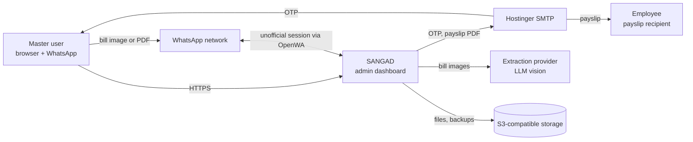
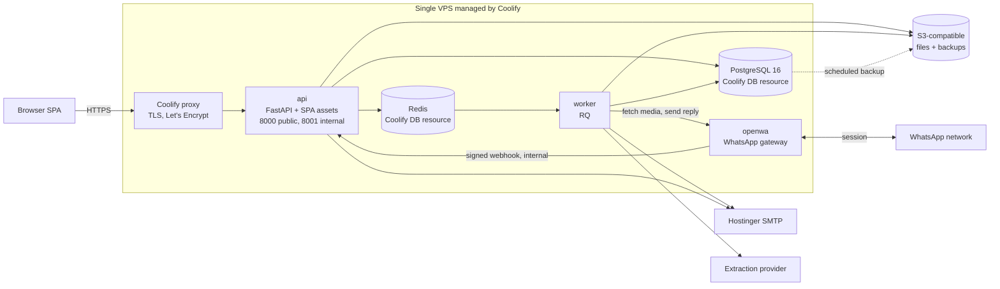
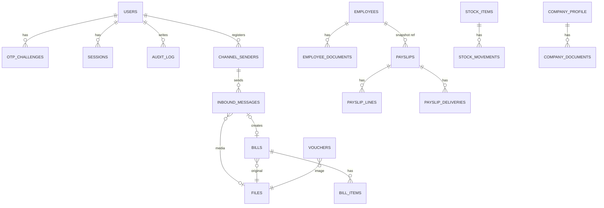
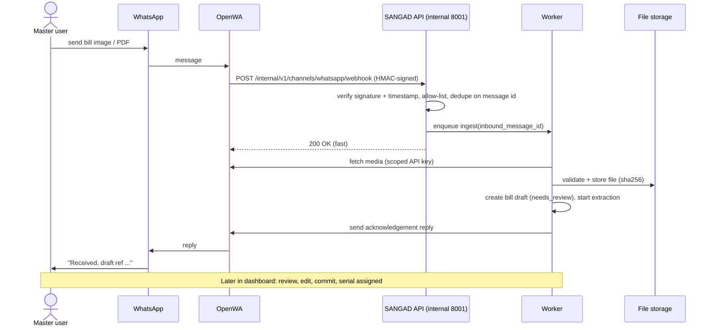
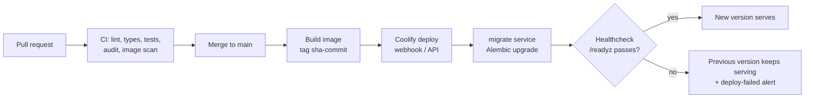

# SANGAD — Architecture & Build Plan

**Product:** Customized Admin Management Dashboard (micro-SaaS)
**Version:** 0.2 · **Date:** 2026-10-02 · **Status:** Draft for approval · **Supersedes:** v0.1 (2026-10-01)
**Sources:** `sangee.docx` (admin plan + 2 UI references), `Payslip_Template_LLP.docx` (Blude TechX LLP payslip)

**What changed in v0.2:**
1. Deployment moves from hand-run Docker Compose + Caddy to **Coolify** (section 3.11, ADR-11).
2. Bills accept **WhatsApp uploads** through **OpenWA**; files land in the database as review drafts (section 3.10, ADR-12, ADR-13).
3. Document restructured to recognised industry practice: stakeholder/view-based architecture description, C4 diagrams, ISO/IEC 25010 quality requirements, OWASP ASVS security targets, risk register, traceability, standards map (sections 0, 2.7, 3, 10-14).

---

## 0. How to use this document

Doc order = build order. Constraints gate everything.

| # | Section | Purpose |
|---|---|---|
| 1 | Constraints | Hard limits, assumptions, quality goals |
| 2 | PRD | What to build (`F-` ids) and quality requirements (`NFR-` ids) |
| 3 | Architecture | How it is structured (`D-` ids): views, data, security, WhatsApp intake, deployment, operations |
| 4 | Design | UI system and screens |
| 5 | Rules | Coding rules for humans and AI agents (`R-` ids) |
| 6 | Tasks | Phased plan (`T-` ids) |
| 7 | Validation | Acceptance checks (`V-` ids) |
| 8 | ADRs | Decisions and trade-offs (`ADR-` ids) |
| 9 | Open questions | Gaps and decisions needed (`Q-` ids) |
| 10 | Traceability | Requirement → task → validation map |
| 11 | Risk register | Risks and mitigations (`RK-` ids) |
| 12 | Standards alignment | Which standards guide which parts |
| 13 | Glossary | Terms and acronyms |
| 14 | Change log | Version history |

**Cross-reference scheme:** `C-` constraint · `F-` requirement · `NFR-` quality requirement · `D-` design · `R-` rule · `T-` task · `V-` validation · `ADR-` decision · `Q-` open question · `RK-` risk.
A task is done only when its linked `V-` ids pass.

**AI-agent protocol (applies to every coding session):**
1. Read sections 1, 3, 5 first, then the one module section being built.
2. One module per session. Never edit another module's tables or internals.
3. Every commit message cites a `T-` id.
4. Do not invent requirements. Unknowns go to section 9.

### 0.1 Stakeholders and concerns (ISO/IEC/IEEE 42010 style)

| Stakeholder | Main concerns | Views that address them |
|---|---|---|
| Business owner / master user | Correct payslips and expenses, easy bill capture, data safe | 2, 3.8-3.10, 4 |
| Employees (data subjects) | Privacy of Aadhaar, salary, DoB; correct payslip | 3.5, 3.7 |
| Developers and AI coding agents | Clear boundaries, rules, testable tasks | 3.4, 5, 6, 7 |
| Operator (runs the server) | Deploy, back up, recover, monitor | 3.11-3.13 |
| Legal / privacy reviewer | DPDP Act compliance, retention, consent | 3.7, 9, 11, 12 |

### 0.2 Architecture views used

| View | Where |
|---|---|
| Context (C4 level 1) | 3.1 |
| Container (C4 level 2) | 3.1 |
| Component / module (C4 level 3) | 3.4 |
| Data | 3.5 |
| Runtime scenarios | 3.8 (payslip), 3.9 (bills), 3.10 (WhatsApp) |
| Deployment | 3.11 |
| Operations and resilience | 3.12, 3.13 |

---

## 1. Constraints, assumptions, quality goals

| Id | Constraint |
|---|---|
| C-01 | Exactly **one master user**. No sign-up, no multi-user UI in v1. Schema supports roles for later. |
| C-02 | Landing page shows exactly **five modules**: Payslip, Bills, Inventory, Employees, Company. |
| C-03 | OTP and payslip emails go through the **Hostinger mailbox** (SMTP). Verify host, port and hourly send limits in the Hostinger panel. |
| C-04 | Currency ₹ INR. Financial year Apr–Mar (current: FY 2026-27). Amounts in words use Indian numbering (lakh, crore). |
| C-05 | PII held: Aadhaar, DoB, address, blood group, salary, contact. Treat under India's DPDP Act 2023: encrypt, mask, audit, restrict. Get legal review before go-live. |
| C-06 | Micro-SaaS cost profile: **single VPS managed by Coolify** (Docker underneath), no Kubernetes. |
| C-07 | Payslip output must match the uploaded Blude TechX LLP template. |
| C-08 | Delivery order: **Architecture → Modules 1-5 built standalone → Integration**. |
| C-09 | **All deployments go through Coolify** (Git-driven). No manual SSH deploys. Server config lives in Coolify; app config lives in environment variables. |
| C-10 | WhatsApp intake uses **OpenWA**, a self-hosted gateway that is **not affiliated with or endorsed by Meta/WhatsApp**. Account-ban risk is accepted by the owner (Q-15). Manual and camera upload remain available if WhatsApp is down. |
| C-11 | Only **allow-listed WhatsApp numbers** (the owner's) may submit bills. Everyone else is ignored. |

**Assumptions (change in section 9 if wrong):**
- A-01 Coolify runs self-hosted on one Linux VPS (Hostinger VPS or any provider). Coolify Cloud as control plane is the alternative (Q-16).
- A-02 Python backend (matches existing team skills: pandas, openpyxl, smtplib).
- A-03 Browser-based, responsive; camera capture works on mobile browsers.
- A-04 Cloud AI is acceptable for bill extraction (with human review). If not, use the local OCR fallback only (ADR-06).
- A-05 A dedicated phone number (not the owner's personal one) is available for the gateway session.
- A-06 An S3-compatible bucket is available for files and backups (Q-20).

**Top quality goals (in priority order):**
1. Security and privacy of PII.
2. Correctness of money, serials, and payslip figures.
3. Auditability of every change.
4. Operability by one person.
5. Modifiability (modules behind ports).

---

## 2. PRD — functional requirements

### 2.1 Auth & shell (shared)

| Id | Requirement |
|---|---|
| F-AUTH-01 | Login with **name + password**, then **email OTP** to the configured Hostinger address. |
| F-AUTH-02 | OTP: 6 digits, 5-minute expiry, single use, max 5 attempts, 60 s resend cooldown. |
| F-AUTH-03 | **Password change requires OTP** verification by email. |
| F-AUTH-04 | Top-right of every page shows **username and role** (role = `master`). |
| F-AUTH-05 | Login lockout after repeated failures; logout; idle session timeout. |
| F-LAND-01 | Landing page shows five module cards only. |

### 2.2 Module 1 — Payslip

| Id | Requirement |
|---|---|
| F-PAY-01 | Data entry by **upload** `.xlsx` / `.csv` (downloadable import template provided). |
| F-PAY-02 | Data entry by **manual form**. |
| F-PAY-03 | Import validates every row; shows row-level errors; nothing is saved until errors are fixed or rows are skipped. |
| F-PAY-04 | After submit, show **preview in payslip format** (matches template). |
| F-PAY-05 | From preview, **edit via form**, re-preview. |
| F-PAY-06 | **Download** payslip (PDF; DOCX optional). |
| F-PAY-07 | **Email** payslip to the employee's address (single and bulk). Track sent / failed; retry failures. |
| F-PAY-08 | Payroll list screen: KPI cards (Total Payroll, Paid Employees, Pending, Avg Salary), search, filter, month picker, list/grid toggle, status badge, View Payslip action. |
| F-PAY-09 | Calculations: `Gross = Basic + Other Allowances`; `Net = Gross − Total Deductions`; Net in words (Indian numbering). |
| F-PAY-10 | Template fields: Employee Name, Employee ID, Designation, Date of Joining, Aadhaar No., Pay Period, Date of Issue, Bank Payment Mode, Total Working Days, Days Paid, Earnings, Net Pay, Net Pay in Words. |
| F-PAY-11 | Letterhead (address, phone, email, website) and signatory name come from company data, not hard-coded. |
| F-PAY-12 | PF note printed only when company setting `pf_applicable = false`. |
| F-PAY-13 | One payslip per employee per month. Lifecycle: `Draft → Generated → Sent`. Edits after `Sent` create a new revision; old revision is kept. |
| F-PAY-14 | Aadhaar on payslip is masked by default (`XXXX XXXX 1234`); full number is a setting. |

### 2.3 Module 2 — Bills

| Id | Requirement |
|---|---|
| F-BILL-01 | Entry by upload (image, PDF, Word), manual form, **camera**, or **WhatsApp** (F-BILL-11). |
| F-BILL-02 | **Auto-extract** date, vendor name, product(s), price from the document. |
| F-BILL-03 | Extraction result lands in a **review** screen; user confirms before commit. |
| F-BILL-04 | Confirmed bills are written to the database and exportable to **Excel / CSV**. |
| F-BILL-05 | Every bill/invoice gets a unique serial: `BILL-<FY>-<6 digits>`, e.g. `BILL-2627-000001`. |
| F-BILL-06 | Cash **vouchers** (below a configurable threshold, default ₹2,000) get a separate serial: `VCH-<FY>-<6 digits>`. Image upload supported. |
| F-BILL-07 | **Expense calculation** across bills + vouchers: totals by period, category, vendor. |
| F-BILL-08 | Expenses screen (per UI reference 2): KPI cards, monthly trend chart (6 months), by-category breakdown, filterable table (All / Paid / Pending / Overdue / Draft), search, export. |
| F-BILL-09 | Duplicate warning (same file hash, or same vendor + date + amount). |
| F-BILL-10 | Original file is always retained and linked to the record. |
| F-BILL-11 | **WhatsApp intake:** an image, PDF or Word file sent from an allow-listed number to the SANGAD WhatsApp number is stored and recorded in the database as a bill draft (`source = whatsapp`, `review_state = needs_review`). |
| F-BILL-12 | Senders not on the allow-list, group chats, and non-document messages are ignored without reply and logged. |
| F-BILL-13 | The system replies on WhatsApp to the sender: "received" plus a draft reference, or the rejection reason (unsupported type, too large, duplicate). |
| F-BILL-14 | One WhatsApp message id creates at most one draft, even if the gateway retries delivery. Duplicate files are flagged per F-BILL-09. |
| F-BILL-15 | WhatsApp drafts appear in a **Needs review** inbox with sender (masked), received time, source badge and thumbnail. Commit follows F-BILL-03 and assigns the serial (F-BILL-05). |
| F-BILL-16 | If the WhatsApp session disconnects, the Bills screen shows a banner and the owner receives an email alert. |

Decision: WhatsApp files are saved to the database at receipt as **drafts** and committed only after human review (ADR-13). Auto-commit above a confidence threshold is out of v1.

### 2.4 Module 3 — Inventory (called "Stocks" in the plan)

| Id | Requirement |
|---|---|
| F-INV-01 | Manual entry only: add, edit, manage stock items via forms. |
| F-INV-02 | Item fields: SKU, name, category, unit, quantity, reorder level, unit cost (extend as needed). |
| F-INV-03 | Stock changes are recorded as **movements** (in / out / adjustment); quantity on hand derives from the ledger. |
| F-INV-04 | Low-stock flag when quantity ≤ reorder level. |
| F-INV-05 | List with search, filter, export. |

### 2.5 Module 4 — Employees

| Id | Requirement |
|---|---|
| F-EMP-01 | Manual entry via form, plus upload of original documents (image, PDF, Word). |
| F-EMP-02 | Fields: Name, DoB, Address, Salary, Employee ID, Contact No., Office No., Designation, Office Address, Aadhaar No., Email, Blood Group. |
| F-EMP-03 | **Added (gap):** Date of Joining, Bank Payment Mode (required by payslip). |
| F-EMP-04 | Aadhaar validated (12 digits, Verhoeff checksum), stored encrypted, masked in UI, full view requires an explicit "reveal" action that is audited. |
| F-EMP-05 | Employee ID unique. Soft-delete only (payslip history must survive). |
| F-EMP-06 | Search, filter, export. |

### 2.6 Module 5 — Company details

| Id | Requirement |
|---|---|
| F-CMP-01 | Manual entry via form, plus upload of original documents (image, PDF, Word). |
| F-CMP-02 | Fields: Legal name, GST No., Incorporation number, registered address, phone, email, website. Suggested: PAN, TAN, authorised signatory name. |
| F-CMP-03 | GSTIN validated by format and checksum. |
| F-CMP-04 | Single company profile record; edits are audited. |
| F-CMP-05 | Feeds payslip letterhead and signatory block (F-PAY-11). |

### 2.7 Quality requirements (ISO/IEC 25010 characteristics)

Targets marked *proposed* need owner confirmation at T-000.

| Id | Characteristic | Requirement | Check |
|---|---|---|---|
| NFR-PERF-01 | Performance | List endpoints p95 < 500 ms at 10k rows; 50-payslip batch PDF < 2 min. | V-PERF-01 |
| NFR-PERF-02 | Performance | WhatsApp file acknowledged within 15 s; draft with extraction visible within 60 s (p95, LLM adapter). | V-WA-04 |
| NFR-AVAIL-01 | Reliability | Availability 99.5 % per month (*proposed*). | V-OPS-01 |
| NFR-REC-01 | Reliability | RPO ≤ 24 h (nightly backup), RTO ≤ 4 h (*proposed*). Tighten RPO with WAL archiving if the owner needs it. | V-PLAT-04 |
| NFR-SEC-01 | Security | OWASP ASVS 4.0 **Level 2** targeted for authentication, sessions, access control, file handling, API. No open critical/high findings at go-live. | V-SEC-01 |
| NFR-PRIV-01 | Security | PII minimised, encrypted in transit and at rest, retention schedule defined, breach runbook exists. | T-704, T-706 |
| NFR-AUD-01 | Security | Audit log is append-only: the application DB role has no UPDATE/DELETE on `audit_log`. | V-SEC-02 |
| NFR-MAINT-01 | Maintainability | Services have ≥ 80 % line coverage (*proposed*); lint, types, tests gate every merge. | V-PLAT-01 |
| NFR-PORT-01 | Portability | Whole stack rebuildable from the repo, Coolify settings, and secrets vault. Config via environment only. | V-PLAT-02, V-DEP-01 |
| NFR-OBS-01 | Operability | Structured logs, health endpoints, alerts for: gateway down, job failures, backup failure, disk > 80 %, certificate expiry. | V-OPS-01 |
| NFR-USAB-01 | Usability | WCAG 2.1 AA; every async action shows progress and result. | 4.4 |
| NFR-COMP-01 | Compatibility | Exports open cleanly in Excel; Indian number formatting; ₹ everywhere. | V-BILL-04 |

---

## 3. Architecture

### 3.1 Style and views — modular monolith (ADR-01)

One backend deployable, one Postgres, one Redis, one worker, one WhatsApp gateway. Five business modules plus a shared kernel. Modules talk through **ports** (interfaces), never through each other's tables.

**Context (C4 level 1)**



**Containers (C4 level 2)**



### 3.2 Technology stack

| Layer | Choice | Why |
|---|---|---|
| Frontend | React 18, TypeScript, Vite, Tailwind, shadcn/ui | Fast, typed, matches both UI references |
| Frontend data | TanStack Query + TanStack Table, React Hook Form + Zod, Recharts | Server-state, tables, forms, charts |
| API client | `openapi-typescript` generated from backend OpenAPI | Contract drift is a build error |
| Backend | Python 3.12, FastAPI, Pydantic v2 | Existing Python skills; auto OpenAPI |
| ORM / DB | SQLAlchemy 2.0, Alembic, PostgreSQL 16 | Relational integrity, migrations |
| Queue | Redis + RQ | Sync-friendly for pandas, openpyxl, WeasyPrint |
| PDF | Jinja2 HTML + WeasyPrint (ADR-03) | One template for preview and PDF |
| Office files | openpyxl, pandas, python-docx / docxtpl | Import/export |
| Money | `decimal.Decimal` + `NUMERIC(14,2)` | Never float (R-05) |
| Hashing | argon2-cffi (Argon2id) | Password hashing |
| Crypto | AES-GCM (`cryptography`), key from env, escrowed offline (R-21) | Field-level encryption for Aadhaar and phone numbers |
| File storage | S3-compatible bucket via `FileStoragePort` (ADR-15) | Durable, versioned, off-server |
| WhatsApp gateway | **OpenWA** (NestJS, MIT), pinned release tag, `ENGINE_TYPE=baileys` to start (ADR-12) | Self-hosted REST API + HMAC-signed webhooks; swappable behind `InboundChannelPort` |
| Deployment | **Coolify** on the VPS: Git push-to-deploy, built-in proxy with automatic TLS, managed Postgres/Redis resources, scheduled DB backups to S3 (ADR-11) | One control plane for deploy, TLS, env, backups, notifications |
| CI | GitHub Actions: ruff, mypy, pytest, eslint, tsc, vitest, Playwright, dependency audit, image scan | Quality gates; CD hands off to Coolify |

OpenWA is a 0.x project; pin the version, test upgrades in staging, and keep a contract test with recorded webhook fixtures (RK-02).

### 3.3 Repository layout

```
sangad/
├─ docs/                      # this file + ADRs + runbooks
├─ backend/
│  ├─ app/
│  │  ├─ main.py
│  │  ├─ core/                # config, db, security, errors, logging
│  │  ├─ kernel/              # shared: auth, audit, files, mail, jobs,
│  │  │                       #   sequences, money, pdf, ports,
│  │  │                       #   channels/whatsapp (OpenWA adapter)
│  │  └─ modules/
│  │     ├─ payslip/          # router, service, repo, models, schemas, templates, tests
│  │     ├─ bills/
│  │     ├─ inventory/
│  │     ├─ employees/
│  │     └─ company/
│  ├─ migrations/             # Alembic, one branch label per module
│  └─ tests/                  # incl. recorded OpenWA webhook fixtures
├─ frontend/
│  └─ src/
│     ├─ app/                 # router, providers, shell
│     ├─ shared/              # ui kit, api client, hooks, utils
│     └─ features/{auth,landing,payslip,bills,inventory,employees,company}/
└─ infra/
   ├─ coolify/                # docker-compose.yml (api, worker, migrate, openwa), .env.example, README
   ├─ runbooks/               # deploy, rollback, restore, WhatsApp re-pair, key escrow, breach
   └─ scripts/                # backup verify, restore drill
```

### 3.4 Module boundaries and integration seams (D-ARCH-01)

Each module is built **standalone** with stub adapters, then integration swaps stubs for real adapters. No module rewrites are needed at integration (ADR-02).

| Module | Owns tables | Exposes | Consumes (ports) | Standalone stub |
|---|---|---|---|---|
| Payslip | `payslips`, `payslip_lines`, `payslip_deliveries`, `import_jobs` | `PayslipService` | `EmployeeDirectoryPort`, `CompanyProfilePort`, `MailPort`, `PdfPort`, `FileStoragePort` | Employee data comes from the upload row / form; company data from a config file |
| Bills | `bills`, `bill_items`, `vouchers`, `extraction_jobs` | `ExpenseSummaryService`; implements `BillIntakePort` | `ExtractionPort`, `SequencePort`, `FileStoragePort`, `MessagingPort` | `MessagingPort` no-op |
| Inventory | `stock_items`, `stock_movements` | `InventoryService` | none | none |
| Employees | `employees`, `employee_documents` | implements `EmployeeDirectoryPort` | `FileStoragePort` | none |
| Company | `company_profile`, `company_documents` | implements `CompanyProfilePort` | `FileStoragePort` | none |
| Kernel | `users`, `otp_challenges`, `sessions`, `audit_log`, `files`, `number_sequences`, `channel_senders`, `inbound_messages` | auth, audit, files, mail, jobs, sequences, `InboundChannelPort` + `MessagingPort` (OpenWA adapter) | — | — |

Port directions for WhatsApp: the kernel adapter receives the webhook, validates and stores the file, then calls `BillIntakePort.submit_draft(file_id, source, meta)`, which the Bills module implements. Bills never talks to OpenWA directly (R-24).

Integration points (Phase 2):
1. Payslip ← Employees: employee picker replaces manual employee fields.
2. Payslip ← Company: letterhead, signatory, `pf_applicable`.
3. Dashboard ← Bills, Inventory, Employees: summary counts on landing cards.

**Payslips store a snapshot** of employee and company fields at issue time. Integration only adds a nullable `employee_ref`. A reissued employee record never rewrites history.

### 3.5 Data model (D-DATA-01)



Key tables (columns abbreviated):

| Table | Key columns / rules |
|---|---|
| `users` | id, username (unique), password_hash, role, email, is_active |
| `otp_challenges` | id, user_id, purpose (`login`/`password_change`), code_hash, expires_at, attempts, consumed_at |
| `employees` | id, employee_code (unique), name, dob, address, salary, contact_no, office_no, designation, office_address, aadhaar_enc, aadhaar_last4, email, blood_group, date_of_joining, payment_mode, deleted_at |
| `payslips` | id, month (`YYYY-MM`), revision, status, snapshot JSONB (employee + company), total_working_days, days_paid, gross, total_deductions, net, net_in_words, issued_on, employee_ref (nullable). Unique (employee key, month, revision) |
| `payslip_lines` | payslip_id, kind (`earning`/`deduction`), label, amount |
| `payslip_deliveries` | payslip_id, to_email, status, attempts, last_error, sent_at |
| `bills` | id, serial (unique, **NULL until commit**), vendor, bill_date, total, category, status (payment: Paid/Pending/Overdue/Draft), **review_state** (`needs_review`/`confirmed`), file_id, source (`upload`/`manual`/`camera`/`whatsapp`), source_ref (inbound_messages id, nullable), extraction_confidence, reviewed_at |
| `bill_items` | bill_id, description, qty, unit_price, amount |
| `vouchers` | id, serial (unique), voucher_date, payee, amount, category, file_id |
| `channel_senders` | id, user_id, channel (`whatsapp`), phone_enc (AES-GCM), phone_hash (keyed HMAC, for lookup), verified_at, is_active |
| `inbound_messages` | id, provider (`openwa`), provider_message_id, sender_id (nullable for unknown), received_at, kind, mime, status (`received`/`stored`/`drafted`/`rejected`/`failed`), reject_reason, file_id, bill_id. **Unique (provider, provider_message_id).** Raw event payloads are not stored |
| `number_sequences` | (series, fy) primary key, last_value. Incremented with `SELECT … FOR UPDATE` in the same transaction as the insert, so numbers are gapless |
| `stock_items` | id, sku (unique), name, category, unit, reorder_level, unit_cost |
| `stock_movements` | id, item_id, kind, qty, reason, created_at. Quantity on hand = sum of movements |
| `company_profile` | single row: legal_name, gstin, incorporation_no, address, phone, email, website, signatory, pf_applicable |
| `files` | id, sha256, mime, size, storage_key, uploaded_by, created_at |
| `audit_log` | id, actor, action, entity, entity_id, at, ip, meta JSONB. Append-only (NFR-AUD-01) |

All tables: `id` UUID, `created_at`, `updated_at`. Add nullable `tenant_id` only if multi-tenant is approved (section 9).

### 3.6 API conventions (D-API-01)

- REST under `/api/v1/<module>/…`; OpenAPI is the contract.
- Errors: RFC 9457 (obsoletes RFC 7807) `application/problem+json` with stable `code`.
- Lists: cursor or page + size, `q` search, explicit `sort`, filters as query params.
- Mutating email/send endpoints take an `Idempotency-Key` header.
- Long work (import, extraction, bulk email, PDF batch) returns `202` + `job_id`; poll `/jobs/{id}`.
- Inbound machine-to-machine webhooks live under `/internal/v1/…`, are served only on the internal listener (port 8001, not routed by the proxy), and are authenticated by HMAC signature, not by session (R-19).
- Money serialised as strings (`"12345.50"`), never JSON floats.

### 3.7 Security (D-SEC-01)

Baseline: OWASP ASVS 4.0 Level 2 (NFR-SEC-01), OWASP Top 10 review before go-live, control themes aligned to ISO/IEC 27001 Annex A (aligned, not certified), DPDP Act 2023 duties confirmed by legal review (T-704).

| Area | Control |
|---|---|
| Passwords | Argon2id; minimum length policy; no hints |
| OTP | Stored hashed; expiry, attempt cap, resend cooldown; rate limit by IP and user |
| Session | Opaque server-side session in Redis; `HttpOnly`, `Secure`, `SameSite=Strict` cookie; CSRF token on mutations; idle timeout (ADR-04) |
| Transport | TLS only, HSTS; certificates issued and renewed by the Coolify proxy |
| PII | Aadhaar and WhatsApp numbers encrypted at field level, masked by default, reveal audited; salary and DoB visible only inside authenticated views |
| Files | Private bucket; served only through authenticated endpoint; size, MIME and magic-byte checks; filenames never trusted; optional AV scan (ClamAV). Applies equally to WhatsApp media (R-20) |
| Imports | Cap file size and row count; parse in worker; never evaluate formulas or macros |
| Audit | Log create/update/delete/export/send/reveal/login events and every inbound WhatsApp accept/reject. Append-only |
| Secrets | Coolify environment variables (marked secret); never in repo; rotation documented. **Encryption key escrowed offline: losing it makes Aadhaar unrecoverable** (R-21) |
| Email | SPF, DKIM, DMARC set on the sending domain; throttle queue to Hostinger limits |
| Backups | Nightly Postgres backup to S3 via Coolify; bucket versioning; restore tested quarterly (V-PLAT-04) |
| Network | Only 80/443 published; SSH restricted by firewall/allow-list; OpenWA and Coolify raw ports not reachable from the internet (V-DEP-02) |
| Coolify control plane | Holds all secrets and server SSH access: give it its own domain, strongest available auth, restricted access, and a regular update cadence (T-009, RK-03) |
| Supply chain | Pinned image tags/digests (no `latest`), dependency audit, image scan and SBOM in CI (R-22, T-707) |

**Threat model — WhatsApp channel (STRIDE)**

| Threat | Example | Control |
|---|---|---|
| Spoofing | Forged webhook call to the API | HMAC signature + timestamp window + internal-only listener (R-19, ADR-14) |
| Spoofing | Stranger messages the number | Sender allow-list; unknown senders ignored (C-11, F-BILL-12) |
| Tampering | Malicious file posing as a bill | Magic-byte/MIME check, size cap, AV scan, parsed only in worker (R-20) |
| Repudiation | "I never sent that" | `inbound_messages` + audit row per message |
| Information disclosure | Bill media or chats lingering in the gateway | Short retention, purge after ingest, gateway storage not public (V-WA-09) |
| Denial of service | Message flood | OpenWA rate limiting + API rate limit + per-sender cap; queue back-pressure |
| Elevation of privilege | Gateway API key used from outside | Scoped key, IP allow-list to the internal network, no public domain for the gateway |

### 3.8 Payslip pipeline (D-PAY-01)

```
Upload/Form → validate (Pydantic) → Draft payslip (snapshot) →
Preview (HTML render) → [Edit form → re-render]* →
Generate PDF (WeasyPrint, worker) → store in files → Download
                                              └→ Email job → Hostinger SMTP → delivery status
```

- Single Jinja2 template drives both the on-screen preview and the PDF, so what is previewed is what is sent.
- `amount_to_words_inr()` is a pure function with unit tests (lakh/crore; paise handled).
- Import template columns: `employee_id, month, working_days, days_paid, basic, other_allowances, deductions (optional), payment_mode, date_of_issue (optional)`. In standalone mode the file also carries name, designation, date of joining, Aadhaar, email.
- Deductions are a list of lines (default empty → `Total Deductions = 0`).
- Optional later: password-protect emailed PDFs.

### 3.9 Bills extraction pipeline (D-BILL-01)

```
Upload / Camera / Manual / WhatsApp → file stored (sha256, dedupe) → bill draft (needs_review) →
extraction job → ExtractionPort.extract(file) → {date, vendor, items[], total, confidence} →
"Needs review" screen → user confirms/edits → commit + serial assigned →
Export to xlsx/csv · counted in expense summary
```

- `ExtractionPort` has two adapters: **LLM vision** (primary) and **local OCR** (Tesseract/PaddleOCR + rules, fallback). Switch by config (ADR-06).
- Extraction output is **never auto-committed**. Low-confidence fields are highlighted.
- Serial is assigned at **commit**, not upload, so rejected drafts leave no gaps (ADR-09). Drafts have `serial = NULL`.
- Word/PDF: convert to page images or text first, then extract. Camera: browser file-capture on mobile, with crop/rotate before upload.
- Voucher vs bill: chosen by the user at review (suggested by amount threshold).

### 3.10 WhatsApp bill intake (D-WA-01)



**Gateway setup**
- OpenWA runs as a service in the same Coolify Compose application, pinned to a released tag, with no public domain.
- Session is paired once with the dedicated number (QR or pairing code) through the OpenWA dashboard, reached only by SSH tunnel or an IP-restricted temporary route. Re-pairing steps are in `infra/runbooks`.
- Gateway storage: SQLite + volume for session data (small, decoupled from the app database). Media is purged after ingest (V-WA-09).
- A scoped API key is minted for SANGAD with an IP allow-list limited to the internal network.
- Webhook subscription: `message.received` and `session.status` only, with an HMAC secret held in Coolify env. Confirm the exact signature header, payload shape and media-fetch endpoint in the OpenWA API reference when building T-209 (Q-24).

**Processing rules**
1. The webhook handler does only: verify, allow-list, insert `inbound_messages` (unique on message id), enqueue, return 200. All other work runs in the worker (R-10).
2. Accept `image/*`, `application/pdf`, and Word MIME types. Everything else gets a rejection reply (allow-listed sender) or is ignored (unknown sender).
3. Each attachment becomes its own draft (Q-18).
4. Replies go only to allow-listed senders, only in response to their message, never as broadcast (R-23). This keeps usage transactional, which OpenWA's own guidance recommends for lowering ban risk.
5. Gateway `session.status` events update a health flag shown on the Bills screen and trigger an email alert (F-BILL-16).

**Failure handling**

| Failure | Behaviour |
|---|---|
| Bad signature, stale timestamp | Reject, no side effects, audit entry |
| Unknown sender / group | Ignore silently, audit entry |
| Duplicate message id (gateway retry) | Return 200, no new draft |
| Unsupported type / too large | No file stored; rejection reply |
| Media fetch fails | Retry with backoff (3×); then `failed` + reply asking to resend or upload in the dashboard |
| SANGAD API down | Gateway retries webhook; idempotency prevents duplicates |
| Gateway session lost | Banner + email; manual and camera upload still work; re-pair per runbook |
| Extraction fails | Draft still exists with file attached; user enters fields manually |

**Fallback:** if the owner will not accept the unofficial-gateway risk, swap the adapter for the official WhatsApp Business Cloud API behind the same `InboundChannelPort` / `MessagingPort` (ADR-12, Q-15). No module code changes.

### 3.11 Deployment on Coolify (D-DEP-01)

| Resource in Coolify | Type | Notes |
|---|---|---|
| `sangad` | Docker Compose application from Git | Services: `api` (serves API + built SPA; domain mapped to port 8000), `worker`, `migrate` (one-shot), `openwa` (no domain) |
| `sangad-postgres` | PostgreSQL 16 database resource | Scheduled backups to S3 (ADR-16) |
| `sangad-redis` | Redis database resource | Persistence on; loss means re-login and re-queued jobs, not data loss |
| Environments | `production`, `staging` | Staging runs with WhatsApp disabled or a test number (Q-21) |

**Delivery flow**



- Migrations run as a pre-start step; the app starts only after they succeed.
- Rollback = redeploy the previous immutable image tag; restore from backup only if a migration damaged data (runbook).
- Environment variables and secrets are set in Coolify; `.env.example` in the repo is the contract (R-17).
- Coolify notifications (deploy results, server health, disk usage) go to email or chat.
- Sizing: start at about 2 vCPU / 4 GB RAM for Coolify + app + Postgres + Redis + OpenWA and measure; plan more memory if the Chromium-based OpenWA engine is chosen.
- Hardening checklist (T-009): give the Coolify dashboard its own domain and close any raw dashboard port, strongest available login protection, firewall to 80/443 plus allow-listed SSH, automatic OS security updates, keep Coolify and OpenWA updated on a schedule.

### 3.12 Observability & operations

- Structured JSON logs with request id; no PII in logs.
- Health endpoints `/healthz` (process up), `/readyz` (DB, Redis, storage reachable). Gateway state is reported as *degraded*, not *not ready*.
- Error tracking (Sentry or self-hosted equivalent).
- Job dashboard (RQ) behind auth.

| Alert | Trigger | Channel |
|---|---|---|
| Deploy failed | Coolify deploy or healthcheck failure | Coolify notification |
| WhatsApp session down | `session.status` not connected > 5 min | Email + Bills banner |
| Job failure rate | Failed jobs above threshold | Email |
| Backup failed | Scheduled backup error or missing | Coolify notification |
| Disk usage | > 80 % | Coolify notification |
| Certificate expiry | < 14 days | Uptime check |
| OTP/payslip mail failures | SMTP errors | Email (via fallback) |

Runbooks in `infra/runbooks`: deploy, rollback, restore from backup, re-pair WhatsApp, rotate secrets, encryption-key escrow and recovery, suspected breach.

### 3.13 Resilience and disaster recovery

| Failure | Impact | Recovery |
|---|---|---|
| VPS lost | Full outage | New VPS → install Coolify → reconnect Git → restore Postgres from S3 → set env from vault → redeploy. Target RTO 4 h |
| Postgres corrupted | Data loss risk | Restore latest backup (RPO ≤ 24 h) |
| Redis lost | Sessions and queued jobs lost | Users log in again; failed jobs re-enqueued from DB state |
| OpenWA session lost | WhatsApp intake paused | Re-pair via runbook; manual/camera upload continues |
| SMTP outage | OTP and payslip emails delayed | Retry queue; payslip delivery status shows pending |
| Extraction provider down | No auto-extract | Switch to local OCR adapter or manual entry |
| Object storage unavailable | Uploads fail | Clear error to user; no partial records (draft created only after file stored) |
| Encryption key lost | Aadhaar unrecoverable | Offline escrow copy (R-21) |

---

## 4. Design

### 4.1 App shell (D-UI-01)

- Layout: left sidebar (five modules + Settings), top bar, content area. Per the two UI references.
- Top bar right: **username + role** (F-AUTH-04), account menu (change password, logout).
- Landing page: five module cards in a grid. Each card: icon, title, one summary figure (after integration).
- Responsive: sidebar collapses on tablet/mobile; tables scroll inside their container.
- Visual language: neutral surfaces, one brand accent (green in reference 2), `₹` everywhere (references show `$` and `₦` as placeholders only).

### 4.2 Shared components (build once in Phase 0)

`AppShell`, `TopBar`, `ModuleCard`, `KpiCard`, `DataTable` (sort, filter, select, paginate), `FilterBar`, `SearchInput`, `StatusBadge`, `FileDropzone`, `CameraCapture`, `FormDrawer`, `ConfirmDialog`, `PdfPreview`, `MoneyText`, `EmptyState`, `Toast`, `OtpInput`.

### 4.3 Screens per module

| Module | Screens |
|---|---|
| Auth | Login → OTP → (Change password + OTP) |
| Payslip | Payroll list (reference 1) · Import wizard (upload → validate → fix → confirm) · Manual form · Preview + Edit · Send/Delivery status |
| Bills | Expenses dashboard (reference 2) · Add bill (upload / manual / camera) · **Needs-review inbox** (WhatsApp and other drafts, source badge, gateway-status banner) · Extraction review · Bill detail with original file · Vouchers list · Export |
| Inventory | Item list · Item form · Movement dialog · Low-stock filter |
| Employees | Employee list · Employee form · Documents tab · Aadhaar reveal dialog |
| Company | Single profile form · Documents tab |

### 4.4 UX rules

- Forms validate inline (Zod) and mirror server rules.
- Destructive actions confirm. Sends confirm recipient count.
- Every async action shows progress and a final result (job states: queued, running, done, failed).
- Accessibility: keyboard navigable, labelled inputs, contrast AA.

---

## 5. Rules

| Id | Rule |
|---|---|
| R-01 | Module code lives only in its own folder. Cross-module access goes through a **port** in `kernel/ports`. |
| R-02 | No module imports another module's models or repository. |
| R-03 | Routers are thin (validate, call service, return). Business logic lives in services. DB access lives in repositories. |
| R-04 | Every endpoint has Pydantic request/response models and an auth dependency. No unauthenticated routes except login, OTP, health. |
| R-05 | Money is `Decimal` / `NUMERIC(14,2)`, serialised as string. Never `float`. |
| R-06 | All dates stored UTC; business dates (`bill_date`, `issued_on`) stored as `DATE`. Display in IST. |
| R-07 | Schema changes only via Alembic migrations. One reviewed migration per change. |
| R-08 | PII never logged. Aadhaar never in URLs, logs, or error messages. |
| R-09 | File uploads: validate size, MIME, magic bytes; store by generated key; never use client filenames for paths. |
| R-10 | Anything slower than ~1 s (import, OCR, PDF batch, email) runs in the worker. |
| R-11 | Extraction output is advisory. Human review precedes commit. |
| R-12 | Serial numbers come only from `SequencePort` inside the insert transaction. |
| R-13 | Every create/update/delete/export/send/reveal writes an audit row. |
| R-14 | Frontend uses the generated API client only. No hand-written fetch to `/api`. |
| R-15 | Each module ships with unit tests, API tests, and one Playwright happy-path before it is "done". |
| R-16 | No new dependency without a one-line justification in the PR. |
| R-17 | Config via environment; `.env.example` kept current; no secrets in git. |
| R-18 | Lint, type-check, tests green in CI before merge. |
| R-19 | Inbound webhooks: verify HMAC signature in constant time, enforce a timestamp window, dedupe on provider message id, respond fast, do the work in the worker. Served only on the internal listener. |
| R-20 | Content from WhatsApp is untrusted. It passes the same checks as any upload (R-09) before it is stored or parsed. |
| R-21 | Secrets and the field-encryption key live in Coolify env. A copy of the encryption key is escrowed offline; recovery is rehearsed. |
| R-22 | Pin third-party runtimes (OpenWA, Postgres, Redis, base images) to explicit tags or digests. Never `latest`. Upgrade in staging first. |
| R-23 | Outbound WhatsApp messages are replies to allow-listed senders only. No broadcast, no cold outreach. |
| R-24 | Modules never call the gateway. They use `InboundChannelPort` / `MessagingPort` / `BillIntakePort`. |
| R-25 | Commits follow Conventional Commits with a `T-` id (`feat(bills): … [T-209]`). API is versioned under `/api/v1`; releases use Semantic Versioning. |


**AI-agent prompt header (paste at the start of each module session):**

```
You are implementing module <NAME> of SANGAD.
Read docs/SANGAD_ARCHITECTURE.md sections 1, 3, 5 and the <NAME> part of section 2.
Implement only task <T-ids>. Satisfy <V-ids>.
Respect rules R-01..R-25. Do not touch other modules. If a requirement is
missing or ambiguous, add it to section 9 instead of guessing.
Output: code, tests, migration, and a short summary of what changed.
```

---

## 6. Tasks

### Phase 0 — Architecture & platform skeleton

| Id | Task | Refs |
|---|---|---|
| T-000 | Approve this document; resolve blocking items in section 9 | all |
| T-001 | Monorepo, tooling, pre-commit, CI pipeline | R-16, R-18, R-25, V-PLAT-01 |
| T-002 | Provision VPS, install Coolify, connect Git, create `sangad` Compose app (api, worker, migrate), Postgres and Redis resources, domain + TLS, env handling | C-06, C-09, R-17, V-PLAT-02, V-DEP-01 |
| T-003 | Backend core: config, DB session, Alembic, error model (RFC 9457), logging | D-API-01, R-07 |
| T-004 | Kernel: auth (login, OTP, session, password change), mail adapter | F-AUTH-01..05, D-SEC-01, V-AUTH-01..06 |
| T-005 | Kernel: audit log (append-only role), files service, sequences, job runner | R-09, R-12, R-13, NFR-AUD-01, V-PLAT-03, V-SEC-02 |
| T-006 | Frontend shell, design tokens, shared components, landing page | D-UI-01, F-LAND-01, V-UI-01 |
| T-007 | OpenAPI → typed client generation wired into build | R-14 |
| T-008 | Backups (Coolify scheduled Postgres backup → S3, bucket versioning), health checks, deploy pipeline (CI → image → Coolify webhook), alerts, restore drill #1 | D-DEP-01, NFR-REC-01, V-PLAT-04, V-DEP-03, V-OPS-01 |
| T-009 | Coolify and server hardening: dashboard access, firewall, SSH allow-list, update cadence, secrets handling, encryption-key escrow | D-SEC-01, R-21, RK-03, V-DEP-02 |
| T-010 | `FileStoragePort` S3 adapter + local adapter for dev | ADR-15, R-09 |

Exit criteria: login with OTP works end to end on the Coolify-deployed environment; landing shows five (empty) module cards; CI green; first backup restored successfully into a scratch server.

### Phase 1 — Modules (each standalone, in your order)

**Module 1 — Payslip**

| Id | Task | Refs |
|---|---|---|
| T-101 | Models, migration, ports with stub adapters | D-DATA-01, D-ARCH-01 |
| T-102 | Calculations + `amount_to_words_inr` + unit tests | F-PAY-09, V-PAY-01 |
| T-103 | Manual form API + UI | F-PAY-02, F-PAY-10 |
| T-104 | Import template + upload validation + wizard | F-PAY-01, F-PAY-03, V-PAY-02 |
| T-105 | Jinja2 template replicating the Blude TechX layout; preview endpoint | F-PAY-04, F-PAY-11, F-PAY-12, V-PAY-03 |
| T-106 | Edit-and-repreview flow, revisions | F-PAY-05, F-PAY-13 |
| T-107 | PDF generation job + download | F-PAY-06, V-PAY-04 |
| T-108 | Email job, delivery tracking, retry, bulk send | F-PAY-07, V-PAY-05 |
| T-109 | Payroll list screen with KPIs | F-PAY-08 |

**Module 2 — Bills**

| Id | Task | Refs |
|---|---|---|
| T-201 | Models, migration (incl. `review_state`, nullable serial), `SequencePort` usage | D-DATA-01, F-BILL-05, F-BILL-06 |
| T-202 | Upload (image/PDF/Word) + camera capture + dedupe | F-BILL-01, F-BILL-09, F-BILL-10 |
| T-203 | `ExtractionPort` + LLM adapter + local OCR adapter | F-BILL-02, D-BILL-01, V-BILL-01 |
| T-204 | Review screen, commit, serial assignment | F-BILL-03, F-BILL-05, V-BILL-02 |
| T-205 | Manual entry form, voucher flow | F-BILL-01, F-BILL-06 |
| T-206 | Excel/CSV export | F-BILL-04, V-BILL-04 |
| T-207 | Expense calculation + dashboard (KPIs, trend, categories, table) | F-BILL-07, F-BILL-08, V-BILL-03 |
| T-208 | Kernel: `channel_senders`, `inbound_messages` migration; `InboundChannelPort`, `MessagingPort`, `BillIntakePort` interfaces | D-WA-01, D-DATA-01, R-24 |
| T-209 | OpenWA adapter: internal webhook receiver (HMAC, timestamp window, allow-list, idempotency); confirm payload/signature/media details against OpenWA API reference | F-BILL-12, F-BILL-14, R-19, V-WA-02, V-WA-03, V-WA-07 |
| T-210 | Ingest worker: fetch media, validate, store, create draft, start extraction, send acknowledgement | F-BILL-11, F-BILL-13, R-20, R-23, V-WA-01, V-WA-04, V-WA-05, V-WA-08 |
| T-211 | Needs-review inbox UI with source badge; gateway-status banner and email alert | F-BILL-15, F-BILL-16, V-WA-06 |
| T-212 | Add `openwa` service to Compose; pin version; scoped API key; pairing runbook; sender allow-list settings screen | C-10, C-11, R-22, V-DEP-02 |
| T-213 | Contract tests from recorded OpenWA webhook fixtures; Playwright path: WhatsApp draft → review → commit | R-15, V-WA-01, V-WA-08 |

**Module 3 — Inventory**

| Id | Task | Refs |
|---|---|---|
| T-301 | Models, migration, movement ledger | F-INV-02, F-INV-03 |
| T-302 | CRUD API + forms + list | F-INV-01, F-INV-05 |
| T-303 | Low-stock logic + export | F-INV-04, V-INV-01 |

**Module 4 — Employees**

| Id | Task | Refs |
|---|---|---|
| T-401 | Models, migration, field encryption for Aadhaar | F-EMP-02, F-EMP-04, V-EMP-01 |
| T-402 | CRUD API + form + list (soft delete) | F-EMP-01, F-EMP-05, F-EMP-06 |
| T-403 | Document upload tab | F-EMP-01 |
| T-404 | Implement `EmployeeDirectoryPort` | D-ARCH-01 |

**Module 5 — Company**

| Id | Task | Refs |
|---|---|---|
| T-501 | Model, migration, GSTIN validator | F-CMP-02, F-CMP-03, V-CMP-01 |
| T-502 | Profile form + documents tab | F-CMP-01, F-CMP-04 |
| T-503 | Implement `CompanyProfilePort` | F-CMP-05 |

Phase 1 exit criteria per module: its `V-` ids pass, R-15 satisfied, module demoable on its own.

### Phase 2 — Integration

| Id | Task | Refs |
|---|---|---|
| T-601 | Swap Payslip stubs for Employees + Company adapters (config flag) | D-ARCH-01, V-INT-01 |
| T-602 | Employee picker in payslip form; import by employee ID resolves from Employees | F-PAY-01, F-PAY-02 |
| T-603 | Letterhead and signatory from Company | F-PAY-11, V-INT-02 |
| T-604 | Landing cards show live summary figures (incl. bills awaiting review) | F-LAND-01, F-BILL-15 |
| T-605 | Cross-module audit review; end-to-end Playwright suite | R-13, V-INT-03 |


### Phase 3 — Hardening & release

| Id | Task | Refs |
|---|---|---|
| T-701 | Security pass: dependency audit, headers, rate limits, pen-test checklist | D-SEC-01, V-SEC-01 |
| T-702 | Performance pass on lists and PDF batch | V-PERF-01 |
| T-703 | Backup restore drill; runbook | V-PLAT-04 |
| T-704 | Legal/privacy review of PII handling (C-05) | C-05 |
| T-705 | UAT with real payslips and bills; go-live | all |
| T-706 | Retention schedule implemented: gateway media/message purge, record retention per legal advice | NFR-PRIV-01, V-WA-09, Q-22 |
| T-707 | Supply chain: SBOM, image scan, pinned digests, update cadence for Coolify/OpenWA | R-22, V-SEC-01 |
| T-708 | Live WhatsApp UAT on the production number with real bills; ban-risk review of messaging pattern | C-10, RK-01 |

---

## 7. Validation

| Id | Check |
|---|---|
| V-PLAT-01 | CI runs lint, types, unit, API, e2e on every PR and blocks on failure. |
| V-PLAT-02 | `docker compose up` from a clean checkout yields a working stack. |
| V-PLAT-03 | Two concurrent inserts never produce a duplicate or skipped serial (load test, 100 parallel). |
| V-PLAT-04 | Restore from last night's backup into a fresh Coolify server succeeds within the RTO (4 h). |
| V-AUTH-01 | Correct password alone does not create a session; OTP is required. |
| V-AUTH-02 | Expired, reused, or 6th-attempt OTP is rejected. |
| V-AUTH-03 | Password change fails without a valid OTP. |
| V-AUTH-04 | After N failed logins the account is locked for the configured window. |
| V-AUTH-05 | Top-right shows username and `master` on every page. |
| V-AUTH-06 | No API route except login/OTP/health responds without a valid session. |
| V-UI-01 | Landing shows exactly five modules. |
| V-PAY-01 | `123456.00` → "One Lakh Twenty-Three Thousand Four Hundred Fifty-Six Rupees Only"; paise and zero cases tested. |
| V-PAY-02 | Bad rows in an import are reported with row number and reason; valid rows can still be imported on request. |
| V-PAY-03 | Rendered payslip matches the template: all fields present, order and wording identical, ₹ symbol, signatory block. |
| V-PAY-04 | Downloaded PDF equals the preview; fonts embedded; renders on A4 without clipping. |
| V-PAY-05 | Email arrives with the PDF attached; failure is recorded and retryable; no duplicate send on retry with the same idempotency key. |
| V-BILL-01 | On a sample set of 30 real bills, date and total are correct for ≥ 90 %; vendor ≥ 85 %. Record the baseline per adapter. |
| V-BILL-02 | Serials are `BILL-<FY>-NNNNNN` and `VCH-<FY>-NNNNNN`, gapless per FY, reset on 1 April. |
| V-BILL-03 | Expense totals equal the sum of bills + vouchers for any date range (reconciled against export). |
| V-BILL-04 | Exported xlsx/csv opens cleanly in Excel; columns and totals match the screen. |
| V-INV-01 | Quantity on hand equals the sum of movements; low-stock flag flips at the threshold. |
| V-EMP-01 | Aadhaar is encrypted in the DB (raw dump shows no plaintext), masked in API list responses, reveal writes an audit row. |
| V-CMP-01 | Valid GSTINs pass; wrong checksum/format fails. |
| V-INT-01 | After integration, a payslip for an existing employee is created without retyping employee data. |
| V-INT-02 | Changing the company address changes new payslips only; old payslips are unchanged. |
| V-INT-03 | Full flow passes in Playwright: login+OTP → add employee → company set → payslip → preview → edit → PDF → email. |
| V-SEC-01 | Dependency audit clean of critical/high; security headers present; no PII in logs. |
| V-PERF-01 | List endpoints p95 < 500 ms at 10k rows; 50-payslip batch PDF completes < 2 min. |
| V-SEC-02 | The application DB role cannot UPDATE or DELETE `audit_log` rows. |
| V-DEP-01 | Merge to main deploys through Coolify; a deliberately failing healthcheck leaves the previous version serving and raises an alert. |
| V-DEP-02 | From the internet only 80/443 respond (SSH only from the allow-list); OpenWA and the raw Coolify port are unreachable. |
| V-DEP-03 | Rollback to the previous image tag completes in under 15 minutes. |
| V-OPS-01 | Each alert in 3.12 fires in a drill (gateway down, failed job, failed backup, disk threshold, deploy failure). |
| V-WA-01 | A valid signed webhook with an image from an allow-listed number creates exactly one `needs_review` bill row with the file linked and `source = whatsapp`. |
| V-WA-02 | Missing/invalid signature, stale timestamp, unknown sender, or group message produces no bill and no file; each is logged. |
| V-WA-03 | Replaying the same message id 5 times still yields one draft. |
| V-WA-04 | Acknowledgement within 15 s; draft with extraction result within 60 s (p95) on the sample set. |
| V-WA-05 | Unsupported type or oversize file: nothing stored, rejection reply sent to the sender. |
| V-WA-06 | Disconnecting the gateway session shows the banner and sends the email alert within 5 minutes. |
| V-WA-07 | The webhook route is not reachable through the public domain. |
| V-WA-08 | A WhatsApp-sourced bill gets its serial only on commit; serials stay gapless (re-run V-PLAT-03 including WhatsApp drafts). |
| V-WA-09 | Media is gone from gateway storage within the retention window after ingest. |

---

## 8. Architecture decision records

| Id | Decision | Alternatives | Why | Status |
|---|---|---|---|---|
| ADR-01 | Modular monolith | Microservices | One admin user, micro-SaaS cost; ports keep a later split possible | Accepted (v0.1) |
| ADR-02 | Standalone modules behind ports with stub adapters | Build modules tightly coupled, wire later | Matches your "build 1-5 individually, then integrate" plan; integration becomes config | Accepted (v0.1) |
| ADR-03 | Payslip via HTML template + WeasyPrint | docxtpl → LibreOffice → PDF | One template for preview and PDF; no LibreOffice in the runtime image. Trade-off: re-creating the Word layout in HTML. Optional DOCX export can use `docxtpl` on the original file later | Accepted (v0.1) |
| ADR-04 | Server-side sessions in Redis | JWT access + refresh | Single user, instant revocation, no token handling in JS | Accepted (v0.1) |
| ADR-05 | Payslip stores a snapshot, not live joins | Join live employee/company rows | Issued payslips are legal records and must not change | Accepted (v0.1) |
| ADR-06 | Extraction behind `ExtractionPort`: LLM vision primary, local OCR fallback | Local OCR only | LLM vision handles varied invoices far better; port allows local-only if bills must not leave the server | Accepted (v0.1) |
| ADR-07 | RQ (Redis) for jobs | Celery, arq | Simplest fit for synchronous pandas/openpyxl/WeasyPrint work | Accepted (v0.1) |
| ADR-08 | Inventory as movement ledger | Editable quantity field | Auditable, supports correction history | Accepted (v0.1) |
| ADR-09 | Serial at commit via locked sequence table | DB `SERIAL`, UUID | Gapless, per-FY reset, no gaps from rejected drafts | Accepted (v0.1) |
| ADR-10 | Vite SPA | Next.js | Pure authenticated dashboard; no SEO or SSR need | Accepted (v0.1) |
| ADR-11 | **Coolify** as the deployment platform (Git push-to-deploy, proxy + TLS, env, DB backups, notifications) | Hand-run Compose + Caddy (v0.1), Kubernetes, hosted PaaS | One control plane for a one-person operation; open source; any VPS. Trade-off: another system to secure and patch that holds all secrets (RK-03, T-009). **Supersedes the v0.1 Compose + Caddy deployment** | Proposed (v0.2) |
| ADR-12 | **OpenWA** as WhatsApp gateway behind `InboundChannelPort` / `MessagingPort` | Official WhatsApp Business Cloud API, hosted gateways, email-forwarding only | Free, MIT, self-hosted, REST + signed webhooks, data stays on the server. Trade-off: unofficial interface, so ToS/ban risk, and 0.x version churn. Mitigation: dedicated number, transactional use, pinned version, contract tests, port allows swap to the official API | Proposed (v0.2) |
| ADR-13 | WhatsApp files stored in the DB as **drafts**; commit only after human review | Auto-commit on extraction | Consistent with R-11 and gapless serials (ADR-09); extraction errors never reach reports unreviewed | Proposed (v0.2) |
| ADR-14 | Webhooks served on an **internal-only listener** (8001), not routed by the proxy | Public endpoint protected by HMAC alone | Removes the forged-call attack surface; HMAC kept as defence in depth | Proposed (v0.2) |
| ADR-15 | Files in an **S3-compatible bucket** from day one | Local volume, S3 later (v0.1) | Off-server durability and versioning fit Coolify's stateless app containers; simplifies backups and restore | Proposed (v0.2) |
| ADR-16 | Postgres and Redis as **Coolify database resources** | Services inside the Compose file | Coolify's scheduled S3 backups apply to its database resources; app redeploys never touch data volumes | Proposed (v0.2) |
| ADR-17 | SPA assets built into the API image and served from one origin | Separate static host | One domain, simpler cookies/CSRF, one deploy unit; no SEO/SSR need (ADR-10) | Proposed (v0.2) |

---

## 9. Open questions (found while reading the source docs)

Blocking before Phase 1 unless marked otherwise. Q-15 to Q-24 are new in v0.2.

| # | Item | Impact | Proposed default |
|---|---|---|---|
| Q-01 | Payslip template shows **Earnings** and "Total Deductions" in the net-pay formula but **no deduction rows**. Which deductions exist (TDS, professional tax, LOP, advances)? | Payslip model | Free-form deduction lines; none by default |
| Q-02 | Is pay **prorated** by `Days Paid / Total Working Days`, or are amounts entered final? | F-PAY-09 | Entered final; optional proration toggle |
| Q-03 | Employee fields in the plan lack **Date of Joining** and **Bank Payment Mode**, both required by the payslip. | F-EMP-03 | Added (done in this doc) |
| Q-04 | Plan says vouchers "under 2000 or 100o". Is the threshold ₹2,000 or ₹1,000? | F-BILL-06 | Configurable, default ₹2,000 |
| Q-05 | Plan says "Stocks" in the body and "Inventory" on the landing page. Which label? | UI | "Inventory" |
| Q-06 | Show full Aadhaar on the payslip or masked? | F-PAY-14, C-05 | Masked |
| Q-07 | Can bill images go to a cloud AI provider? If not, local OCR only and lower accuracy. | ADR-06, V-BILL-01 | Cloud with review; switchable |
| Q-08 | Bill categories and statuses (Paid / Pending / Overdue / Draft in the reference). Fixed list or user-managed? | F-BILL-08 | Fixed starter list, editable later |
| Q-09 | Multi-tenant SaaS (several companies) now or later? Adds `tenant_id` everywhere. | C-01, data model | Single tenant now; do not paint into a corner |
| Q-10 | Overtime and Recurring columns appear in reference 1 but not in the payslip template. In scope? | F-PAY-08 | Out of v1 |
| Q-11 | Password-protect emailed payslip PDFs? If yes, with what secret? | F-PAY-07 | Off in v1 |
| Q-12 | Hostinger hourly/daily send limits vs. bulk payslip volume. | F-PAY-07 | Throttled queue; confirm limits |
| Q-13 | Domain / hostname for the app, the Coolify dashboard, and the sending domain (SPF/DKIM). | Deploy | Needed at T-002 |
| Q-14 | Is the OTP recipient fixed to the one mailbox in the plan, or stored per user? | F-AUTH-01 | Stored on the user record; configured at setup |
| Q-15 | Accept the ToS/ban risk of an unofficial WhatsApp gateway (OpenWA), or use the official WhatsApp Business Cloud API? **Blocking for T-209.** | C-10, ADR-12, RK-01 | OpenWA with a dedicated number; port allows swap |
| Q-16 | Coolify self-hosted on the same VPS, or Coolify Cloud as control plane with your VPS attached? | A-01, T-002 | Self-hosted on the VPS |
| Q-17 | Which number(s) may send bills, and which dedicated number runs the gateway? | C-11, F-BILL-12 | One allowed number (owner); separate gateway number |
| Q-18 | Several attachments in one message, or a multi-page bill split across images: one bill per attachment or merge? | F-BILL-11 | One draft per attachment; merge manually |
| Q-19 | Should caption keywords (e.g. "voucher", a category) pre-fill the review form? | F-BILL-11 | Out of v1 |
| Q-20 | Object-storage provider and region for files and backups (an India region keeps residency simple under DPDP). | ADR-15, A-06 | S3-compatible bucket in an India region |
| Q-21 | Staging environment: second Coolify environment on the same VPS, WhatsApp disabled? | 3.11 | Yes |
| Q-22 | Retention periods for bills, payslips, WhatsApp media and gateway message data. Legal to confirm. | NFR-PRIV-01, T-706 | Gateway media purged within 24 h of ingest; records per legal advice |
| Q-23 | WhatsApp reply content: "received + reference" only, or also the extracted summary? | F-BILL-13 | Received + reference only |
| Q-24 | Confirm OpenWA webhook signature header, payload fields, and media-fetch endpoint against the current API reference (docs target v0.23.5). | T-209 | Resolve at start of T-209 |

---

## 10. Traceability matrix

| Area | Requirements | Tasks | Validation |
|---|---|---|---|
| Platform and deploy | C-06, C-09, NFR-PORT-01, NFR-REC-01 | T-001, T-002, T-008, T-009, T-010 | V-PLAT-01..04, V-DEP-01..03 |
| Auth and shell | F-AUTH-01..05, F-LAND-01 | T-004, T-006 | V-AUTH-01..06, V-UI-01 |
| Payslip | F-PAY-01..14 | T-101..T-109 | V-PAY-01..05 |
| Bills (core) | F-BILL-01..10 | T-201..T-207 | V-BILL-01..04 |
| Bills via WhatsApp | F-BILL-11..16, C-10, C-11 | T-208..T-213, T-706, T-708 | V-WA-01..09 |
| Inventory | F-INV-01..05 | T-301..T-303 | V-INV-01 |
| Employees | F-EMP-01..06 | T-401..T-404 | V-EMP-01 |
| Company | F-CMP-01..05 | T-501..T-503 | V-CMP-01 |
| Integration | D-ARCH-01 | T-601..T-605 | V-INT-01..03 |
| Security and privacy | NFR-SEC-01, NFR-PRIV-01, NFR-AUD-01, C-05 | T-005, T-009, T-701, T-704, T-707 | V-SEC-01..02 |
| Performance | NFR-PERF-01..02 | T-702 | V-PERF-01, V-WA-04 |
| Operations | NFR-OBS-01, NFR-AVAIL-01 | T-008, T-703 | V-OPS-01 |

---

## 11. Risk register

Likelihood (L) and impact (I): H high, M medium, L low.

| Id | Risk | L | I | Mitigation |
|---|---|---|---|---|
| RK-01 | WhatsApp number banned or session dropped (unofficial gateway) | M | M | Dedicated number; transactional, reply-only use (R-23); alerting; manual and camera upload always work; swap to official API via the port |
| RK-02 | OpenWA 0.x release breaks the webhook or API contract | M | M | Pinned version; upgrade in staging; recorded-fixture contract tests (T-213) |
| RK-03 | Coolify control plane compromised (holds secrets and SSH) | L | H | Hardening (T-009), restricted access, update cadence, no raw ports |
| RK-04 | Single VPS failure | M | H | Nightly S3 backups, off-server files, runbook, quarterly restore drill |
| RK-05 | Encryption key lost | L | H | Offline escrow (R-21), rehearsed recovery |
| RK-06 | PII exposure (Aadhaar, salary) | L | H | Field encryption, masking, audit, ASVS L2, legal review (T-704) |
| RK-07 | Wrong extraction committed to the books | M | M | Human review (ADR-13), confidence flags, reconciliation (V-BILL-03) |
| RK-08 | Hostinger SMTP limits throttle payslips or OTP | M | M | Throttled queue, confirm limits (Q-12) |
| RK-09 | Bill images sent to a cloud AI provider against policy | M | M | Switchable local OCR adapter (Q-07) |
| RK-10 | Forged inbound webhook | L | M | HMAC + internal-only listener (ADR-14) |
| RK-11 | Single maintainer / knowledge loss | M | M | Docs-first, AI-agent protocol, runbooks |

---

## 12. Standards alignment

"Aligned" means the practice guides the design. It does not claim certification or audit.

| Standard / practice | How it is applied | Where |
|---|---|---|
| ISO/IEC/IEEE 42010 (architecture description) | Stakeholders, concerns, named views | 0.1, 0.2, 3 |
| C4 model (notation convention) | Context and container diagrams, module table as components | 3.1, 3.4 |
| arc42 (section layout) | Constraints, context, building blocks, runtime, deployment, decisions, quality, risks, glossary | 1-3, 8, 11, 13 |
| ISO/IEC 25010 (quality model) | Quality requirements per characteristic | 2.7 |
| ISO/IEC/IEEE 29148 (requirements practice) | Unique ids, verifiable statements, traceability | 2, 10 |
| OWASP ASVS 4.0 (Level 2) and OWASP Top 10 | Security controls and go-live review | 3.7, T-701 |
| ISO/IEC 27001 Annex A (control themes) | Access, crypto, logging, backup, supplier, change management | 3.7, 3.11 |
| India DPDP Act 2023 | PII handling, retention, breach response; legal review | C-05, T-704, T-706 |
| The Twelve-Factor App | Config in env, stateless processes, disposable containers, logs as streams | R-17, 3.11 |
| OpenAPI 3.x, RFC 9457 Problem Details | Contract-first API and error model | 3.6 |
| ADR practice (Nygard / MADR) | Decisions with alternatives and status | 8 |
| Semantic Versioning, Conventional Commits | Release and commit discipline | R-25 |
| WCAG 2.1 AA | Accessibility | 4.4, NFR-USAB-01 |

---

## 13. Glossary

| Term | Meaning |
|---|---|
| ADR | Architecture decision record |
| ASVS | OWASP Application Security Verification Standard |
| Coolify | Self-hosted deployment platform used to run SANGAD on the VPS |
| DPDP | Digital Personal Data Protection Act, 2023 (India) |
| FY | Financial year, April to March |
| GSTIN | GST identification number |
| Needs review | State of a bill draft awaiting human confirmation |
| OpenWA | Self-hosted, unofficial WhatsApp API gateway used for bill intake |
| Port / adapter | Interface a module depends on, and a swappable implementation of it |
| RPO / RTO | Recovery point / recovery time objective |
| Voucher | Cash receipt below the voucher threshold, with its own serial series |

---

## 14. Change log

| Version | Date | Changes |
|---|---|---|
| 0.2 | 2026-10-02 | Coolify deployment (ADR-11, 3.11); WhatsApp intake via OpenWA (F-BILL-11..16, 3.10, ADR-12..14); S3 file storage and Coolify DB resources (ADR-15, 16); quality requirements, STRIDE model, DR, traceability, risks, standards map; RFC 7807 updated to RFC 9457; integration phase corrected to Phase 2 |
| 0.1 | 2026-10-01 | Initial architecture and build plan |

---

*End of document.*
