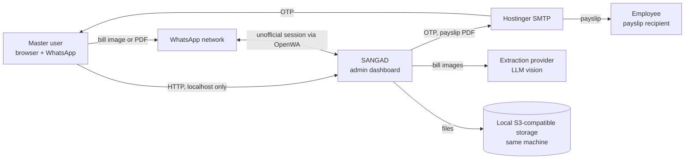
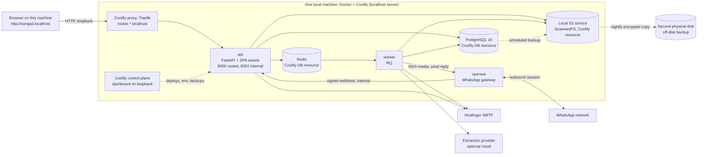
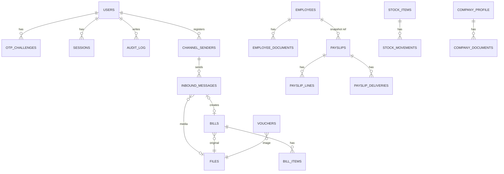
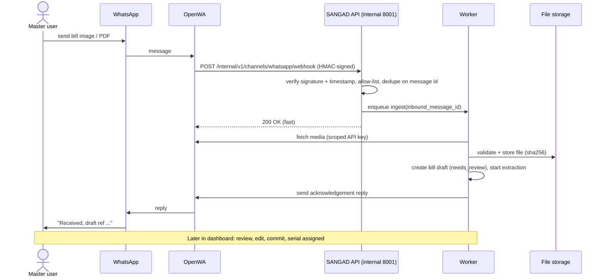
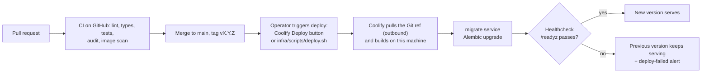

# SANGAD — Architecture & Build Plan

**Product:** Customized Admin Management Dashboard (micro-SaaS)
**Version:** 0.3 · **Date:** 2026-10-03 · **Status:** Draft for approval · **Supersedes:** v0.2 (2026-10-02)
**Sources:** `sangee.docx` (admin plan + 2 UI references), `Payslip_Template_LLP.docx` (Blude TechX LLP payslip)

**What changed in v0.3:**
1. The stack now runs **completely on localhost**: one local machine, Docker, and a self-hosted **Coolify** instance on that same machine. The VPS is gone (section 3.11, ADR-18).
2. File storage moves from an external bucket to a **local S3-compatible service** run as a Coolify resource, with a mandatory **off-disk backup copy** (ADR-19, sections 3.11 and 3.13).
3. The app is reached at `http://sangad.localhost`. No public domain, no Let's Encrypt. Every port is bound to loopback (ADR-20, section 3.7).
4. Deploys are started from Coolify (button or API script) because GitHub webhooks cannot reach localhost. Availability, backup, alerting and validation are rewritten for a single local host (NFR-AVAIL-01, V-LOC-01..04).

---

## 0. How to use this document

Doc order = build order. Constraints gate everything.

| # | Section | Purpose |
|---|---|---|
| 1 | Constraints | Hard limits, assumptions, quality goals |
| 2 | PRD | What to build (`F-` ids) and quality requirements (`NFR-` ids) |
| 3 | Architecture | How it is structured (`D-` ids): views, data, security, WhatsApp intake, deployment, operations |
| 4 | Design | UI system and screens |
| 5 | Rules | Coding rules for humans and AI agents (`R-` ids) |
| 6 | Tasks | Phased plan (`T-` ids) |
| 7 | Validation | Acceptance checks (`V-` ids) |
| 8 | ADRs | Decisions and trade-offs (`ADR-` ids) |
| 9 | Open questions | Gaps and decisions needed (`Q-` ids) |
| 10 | Traceability | Requirement → task → validation map |
| 11 | Risk register | Risks and mitigations (`RK-` ids) |
| 12 | Standards alignment | Which standards guide which parts |
| 13 | Glossary | Terms and acronyms |
| 14 | Change log | Version history |

**Cross-reference scheme:** `C-` constraint · `F-` requirement · `NFR-` quality requirement · `D-` design · `R-` rule · `T-` task · `V-` validation · `ADR-` decision · `Q-` open question · `RK-` risk.
A task is done only when its linked `V-` ids pass.

**AI-agent protocol (applies to every coding session):**
1. Read sections 1, 3, 5 first, then the one module section being built.
2. One module per session. Never edit another module's tables or internals.
3. Every commit message cites a `T-` id.
4. Do not invent requirements. Unknowns go to section 9.

### 0.1 Stakeholders and concerns (ISO/IEC/IEEE 42010 style)

| Stakeholder | Main concerns | Views that address them |
|---|---|---|
| Business owner / master user | Correct payslips and expenses, easy bill capture, data safe | 2, 3.8-3.10, 4 |
| Employees (data subjects) | Privacy of Aadhaar, salary, DoB; correct payslip | 3.5, 3.7 |
| Developers and AI coding agents | Clear boundaries, rules, testable tasks | 3.4, 5, 6, 7 |
| Operator (runs the local machine) | Deploy, back up, recover, monitor; keep the host on, encrypted and patched | 3.11-3.13 |
| Legal / privacy reviewer | DPDP Act compliance, retention, consent | 3.7, 9, 11, 12 |

### 0.2 Architecture views used

| View | Where |
|---|---|
| Context (C4 level 1) | 3.1 |
| Container (C4 level 2) | 3.1 |
| Component / module (C4 level 3) | 3.4 |
| Data | 3.5 |
| Runtime scenarios | 3.8 (payslip), 3.9 (bills), 3.10 (WhatsApp) |
| Deployment | 3.11 |
| Operations and resilience | 3.12, 3.13 |

---

## 1. Constraints, assumptions, quality goals

| Id | Constraint |
|---|---|
| C-01 | Exactly **one master user**. No sign-up, no multi-user UI in v1. Schema supports roles for later. |
| C-02 | Landing page shows exactly **five modules**: Payslip, Bills, Inventory, Employees, Company. |
| C-03 | OTP and payslip emails go through the **Hostinger mailbox** (SMTP). Verify host, port and hourly send limits in the Hostinger panel. |
| C-04 | Currency ₹ INR. Financial year Apr–Mar (current: FY 2026-27). Amounts in words use Indian numbering (lakh, crore). |
| C-05 | PII held: Aadhaar, DoB, address, blood group, salary, contact. Treat under India's DPDP Act 2023: encrypt, mask, audit, restrict. Get legal review before go-live. |
| C-06 | Micro-SaaS cost profile: **one local machine running Docker, managed by a self-hosted Coolify instance on that same machine**. No VPS, no Kubernetes, no hosting bill. Outbound-only dependencies: SMTP, the WhatsApp network, Git and image pulls, and (optionally) the extraction provider. |
| C-07 | Payslip output must match the uploaded Blude TechX LLP template. |
| C-08 | Delivery order: **Architecture → Modules 1-5 built standalone → Integration**. |
| C-09 | **All deployments go through Coolify.** No ad-hoc `docker run` or hand-edited Compose on the host. A deploy is started from the Coolify UI or `infra/scripts/deploy.sh` (Coolify API), because GitHub webhooks cannot reach localhost (ADR-18). Server config lives in Coolify; app config lives in environment variables. |
| C-10 | WhatsApp intake uses **OpenWA**, a self-hosted gateway that is **not affiliated with or endorsed by Meta/WhatsApp**. Account-ban risk is accepted by the owner (Q-15). Manual and camera upload remain available if WhatsApp is down. |
| C-11 | Only **allow-listed WhatsApp numbers** (the owner's) may submit bills. Everyone else is ignored. |
| C-12 | **Completely on localhost.** App, database, queue, file store, WhatsApp gateway and Coolify itself run on one machine and are reachable only from that machine by default (`http://sangad.localhost`). LAN or remote access is opt-in and needs TLS first (Q-25, ADR-20). |
| C-13 | **Availability equals host uptime.** The stack runs only while the machine is on. WhatsApp intake pauses when it is off (RK-12). No uptime SLA. |
| C-14 | The host disk is **fully encrypted**, and a copy of every backup lives on a **separate physical disk** (RK-04, RK-13). |

**Assumptions (change in section 9 if wrong):**
- A-01 Coolify runs self-hosted on the same machine as the app, using its built-in `localhost` server. Supported baseline is Ubuntu 22.04/24.04 LTS on bare metal or in a VM. WSL2 on Windows is possible but unofficial (Q-16).
- A-02 Python backend (matches existing team skills: pandas, openpyxl, smtplib).
- A-03 Browser-based, responsive. On the host, use its desktop browser. Phone camera capture needs LAN access (Q-25); otherwise phones send bills through WhatsApp.
- A-04 Cloud AI is acceptable for bill extraction (with human review). If not, use the local OCR fallback only (ADR-06). This is the only flow that sends bill content off the machine (Q-07, Q-28).
- A-05 A dedicated phone number (not the owner's personal one) is available for the gateway session.
- A-06 A local S3-compatible service (a Coolify resource) holds files. A second physical disk (USB or internal) holds the off-disk backup copy (Q-20). An encrypted off-site copy is optional.
- A-07 The host has at least 8 GB RAM (16 GB recommended) and an SSD with 100 GB+ free. Sleep and hibernate are off on AC power; a UPS is recommended.

**Top quality goals (in priority order):**
1. Security and privacy of PII.
2. Correctness of money, serials, and payslip figures.
3. Auditability of every change.
4. Operability by one person.
5. Modifiability (modules behind ports).

---

## 2. PRD — functional requirements

### 2.1 Auth & shell (shared)

| Id | Requirement |
|---|---|
| F-AUTH-01 | Login with **name + password**, then **email OTP** to the configured Hostinger address. |
| F-AUTH-02 | OTP: 6 digits, 5-minute expiry, single use, max 5 attempts, 60 s resend cooldown. |
| F-AUTH-03 | **Password change requires OTP** verification by email. |
| F-AUTH-04 | Top-right of every page shows **username and role** (role = `master`). |
| F-AUTH-05 | Login lockout after repeated failures; logout; idle session timeout. |
| F-LAND-01 | Landing page shows five module cards only. |

### 2.2 Module 1 — Payslip

| Id | Requirement |
|---|---|
| F-PAY-01 | Data entry by **upload** `.xlsx` / `.csv` (downloadable import template provided). |
| F-PAY-02 | Data entry by **manual form**. |
| F-PAY-03 | Import validates every row; shows row-level errors; nothing is saved until errors are fixed or rows are skipped. |
| F-PAY-04 | After submit, show **preview in payslip format** (matches template). |
| F-PAY-05 | From preview, **edit via form**, re-preview. |
| F-PAY-06 | **Download** payslip (PDF; DOCX optional). |
| F-PAY-07 | **Email** payslip to the employee's address (single and bulk). Track sent / failed; retry failures. |
| F-PAY-08 | Payroll list screen: KPI cards (Total Payroll, Paid Employees, Pending, Avg Salary), search, filter, month picker, list/grid toggle, status badge, View Payslip action. |
| F-PAY-09 | Calculations: `Gross = Basic + Other Allowances`; `Net = Gross − Total Deductions`; Net in words (Indian numbering). |
| F-PAY-10 | Template fields: Employee Name, Employee ID, Designation, Date of Joining, Aadhaar No., Pay Period, Date of Issue, Bank Payment Mode, Total Working Days, Days Paid, Earnings, Net Pay, Net Pay in Words. |
| F-PAY-11 | Letterhead (address, phone, email, website) and signatory name come from company data, not hard-coded. |
| F-PAY-12 | PF note printed only when company setting `pf_applicable = false`. |
| F-PAY-13 | One payslip per employee per month. Lifecycle: `Draft → Generated → Sent`. Edits after `Sent` create a new revision; old revision is kept. |
| F-PAY-14 | Aadhaar on payslip is masked by default (`XXXX XXXX 1234`); full number is a setting. |

### 2.3 Module 2 — Bills

| Id | Requirement |
|---|---|
| F-BILL-01 | Entry by upload (image, PDF, Word), manual form, **camera**, or **WhatsApp** (F-BILL-11). |
| F-BILL-02 | **Auto-extract** date, vendor name, product(s), price from the document. |
| F-BILL-03 | Extraction result lands in a **review** screen; user confirms before commit. |
| F-BILL-04 | Confirmed bills are written to the database and exportable to **Excel / CSV**. |
| F-BILL-05 | Every bill/invoice gets a unique serial: `BILL-<FY>-<6 digits>`, e.g. `BILL-2627-000001`. |
| F-BILL-06 | Cash **vouchers** (below a configurable threshold, default ₹2,000) get a separate serial: `VCH-<FY>-<6 digits>`. Image upload supported. |
| F-BILL-07 | **Expense calculation** across bills + vouchers: totals by period, category, vendor. |
| F-BILL-08 | Expenses screen (per UI reference 2): KPI cards, monthly trend chart (6 months), by-category breakdown, filterable table (All / Paid / Pending / Overdue / Draft), search, export. |
| F-BILL-09 | Duplicate warning (same file hash, or same vendor + date + amount). |
| F-BILL-10 | Original file is always retained and linked to the record. |
| F-BILL-11 | **WhatsApp intake:** an image, PDF or Word file sent from an allow-listed number to the SANGAD WhatsApp number is stored and recorded in the database as a bill draft (`source = whatsapp`, `review_state = needs_review`). |
| F-BILL-12 | Senders not on the allow-list, group chats, and non-document messages are ignored without reply and logged. |
| F-BILL-13 | The system replies on WhatsApp to the sender: "received" plus a draft reference, or the rejection reason (unsupported type, too large, duplicate). |
| F-BILL-14 | One WhatsApp message id creates at most one draft, even if the gateway retries delivery. Duplicate files are flagged per F-BILL-09. |
| F-BILL-15 | WhatsApp drafts appear in a **Needs review** inbox with sender (masked), received time, source badge and thumbnail. Commit follows F-BILL-03 and assigns the serial (F-BILL-05). |
| F-BILL-16 | If the WhatsApp session disconnects, the Bills screen shows a banner and the owner receives an email alert. |

Decision: WhatsApp files are saved to the database at receipt as **drafts** and committed only after human review (ADR-13). Auto-commit above a confidence threshold is out of v1.

### 2.4 Module 3 — Inventory (called "Stocks" in the plan)

| Id | Requirement |
|---|---|
| F-INV-01 | Manual entry only: add, edit, manage stock items via forms. |
| F-INV-02 | Item fields: SKU, name, category, unit, quantity, reorder level, unit cost (extend as needed). |
| F-INV-03 | Stock changes are recorded as **movements** (in / out / adjustment); quantity on hand derives from the ledger. |
| F-INV-04 | Low-stock flag when quantity ≤ reorder level. |
| F-INV-05 | List with search, filter, export. |

### 2.5 Module 4 — Employees

| Id | Requirement |
|---|---|
| F-EMP-01 | Manual entry via form, plus upload of original documents (image, PDF, Word). |
| F-EMP-02 | Fields: Name, DoB, Address, Salary, Employee ID, Contact No., Office No., Designation, Office Address, Aadhaar No., Email, Blood Group. |
| F-EMP-03 | **Added (gap):** Date of Joining, Bank Payment Mode (required by payslip). |
| F-EMP-04 | Aadhaar validated (12 digits, Verhoeff checksum), stored encrypted, masked in UI, full view requires an explicit "reveal" action that is audited. |
| F-EMP-05 | Employee ID unique. Soft-delete only (payslip history must survive). |
| F-EMP-06 | Search, filter, export. |

### 2.6 Module 5 — Company details

| Id | Requirement |
|---|---|
| F-CMP-01 | Manual entry via form, plus upload of original documents (image, PDF, Word). |
| F-CMP-02 | Fields: Legal name, GST No., Incorporation number, registered address, phone, email, website. Suggested: PAN, TAN, authorised signatory name. |
| F-CMP-03 | GSTIN validated by format and checksum. |
| F-CMP-04 | Single company profile record; edits are audited. |
| F-CMP-05 | Feeds payslip letterhead and signatory block (F-PAY-11). |

### 2.7 Quality requirements (ISO/IEC 25010 characteristics)

Targets marked *proposed* need owner confirmation at T-000.

| Id | Characteristic | Requirement | Check |
|---|---|---|---|
| NFR-PERF-01 | Performance | List endpoints p95 < 500 ms at 10k rows; 50-payslip batch PDF < 2 min. | V-PERF-01 |
| NFR-PERF-02 | Performance | WhatsApp file acknowledged within 15 s; draft with extraction visible within 60 s (p95, LLM adapter). | V-WA-04 |
| NFR-AVAIL-01 | Reliability | Best effort while the host is powered on, no monthly SLA (C-13). After a reboot the whole stack starts by itself and is healthy within 5 minutes. | V-LOC-01, V-OPS-01 |
| NFR-REC-01 | Reliability | RPO ≤ 24 h (nightly backup, copied off the primary disk), RTO ≤ 4 h onto a replacement machine (*proposed*). Tighten RPO with WAL archiving if the owner needs it. | V-PLAT-04, V-LOC-04 |
| NFR-SEC-01 | Security | OWASP ASVS 4.0 **Level 2** targeted for authentication, sessions, access control, file handling, API. No open critical/high findings at go-live. | V-SEC-01 |
| NFR-SEC-02 | Security | Host disk encrypted (LUKS or BitLocker). No SANGAD, Coolify, gateway, database or storage port is reachable from the LAN (C-12, C-14). | V-DEP-02, V-LOC-02 |
| NFR-PRIV-01 | Security | PII minimised, encrypted in transit and at rest, retention schedule defined, breach runbook exists. | T-704, T-706 |
| NFR-AUD-01 | Security | Audit log is append-only: the application DB role has no UPDATE/DELETE on `audit_log`. | V-SEC-02 |
| NFR-MAINT-01 | Maintainability | Services have ≥ 80 % line coverage (*proposed*); lint, types, tests gate every merge. | V-PLAT-01 |
| NFR-PORT-01 | Portability | Whole stack rebuildable on a replacement machine from the repo, the Coolify setup notes, the secrets vault and the off-disk backup. Config via environment only. | V-PLAT-02, V-DEP-01 |
| NFR-OBS-01 | Operability | Structured logs, health endpoints, alerts for: gateway down, job failures, backup failure, disk > 80 %, off-disk backup copy missing or older than 26 h. | V-OPS-01 |
| NFR-USAB-01 | Usability | WCAG 2.1 AA; every async action shows progress and result. | 4.4 |
| NFR-COMP-01 | Compatibility | Exports open cleanly in Excel; Indian number formatting; ₹ everywhere. | V-BILL-04 |

---

## 3. Architecture

### 3.1 Style and views — modular monolith (ADR-01)

One backend deployable, one Postgres, one Redis, one worker, one WhatsApp gateway and one local S3-compatible store, all on one machine. Five business modules plus a shared kernel. Modules talk through **ports** (interfaces), never through each other's tables.

**Context (C4 level 1)**



**Containers (C4 level 2)**



### 3.2 Technology stack

| Layer | Choice | Why |
|---|---|---|
| Frontend | React 18, TypeScript, Vite, Tailwind, shadcn/ui | Fast, typed, matches both UI references |
| Frontend data | TanStack Query + TanStack Table, React Hook Form + Zod, Recharts | Server-state, tables, forms, charts |
| API client | `openapi-typescript` generated from backend OpenAPI | Contract drift is a build error |
| Backend | Python 3.12, FastAPI, Pydantic v2 | Existing Python skills; auto OpenAPI |
| ORM / DB | SQLAlchemy 2.0, Alembic, PostgreSQL 16 | Relational integrity, migrations |
| Queue | Redis + RQ | Sync-friendly for pandas, openpyxl, WeasyPrint |
| PDF | Jinja2 HTML + WeasyPrint (ADR-03) | One template for preview and PDF |
| Office files | openpyxl, pandas, python-docx / docxtpl | Import/export |
| Money | `decimal.Decimal` + `NUMERIC(14,2)` | Never float (R-05) |
| Hashing | argon2-cffi (Argon2id) | Password hashing |
| Crypto | AES-GCM (`cryptography`), key from env, escrowed offline (R-21) | Field-level encryption for Aadhaar and phone numbers |
| File storage | Local S3-compatible service (SeaweedFS, S3 API only) run as a Coolify resource, reached through `FileStoragePort` with an endpoint from env (ADR-15, ADR-19) | One S3 contract in dev and production. MinIO's community edition is archived and no longer ships images, so it is not the default |
| WhatsApp gateway | **OpenWA** (NestJS, MIT), pinned release tag, `ENGINE_TYPE=baileys` to start (ADR-12) | Self-hosted REST API + HMAC-signed webhooks; swappable behind `InboundChannelPort` |
| Deployment | **Docker + self-hosted Coolify on the local machine**: built-in Traefik proxy on `*.localhost`, managed Postgres/Redis/S3 resources, scheduled DB backups, notifications. Deploys start from the Coolify UI or API (ADR-11, ADR-18) | One control plane for deploy, env, backups and notifications, without a VPS |
| CI / CD | GitHub Actions gates merges: ruff, mypy, pytest, eslint, tsc, vitest, Playwright, dependency audit, image scan. CD is a manual trigger of Coolify (UI or `deploy.sh`) | CI runs in the cloud and cannot reach localhost, so it gates but does not deploy |
| Off-disk backup | `restic` (encrypted, deduplicated) copies S3 data, DB backups and Coolify data to a second physical disk nightly, run by a host timer | Protects against single-disk loss (RK-04) |

OpenWA is a 0.x project; pin the version, test upgrades in staging, and keep a contract test with recorded webhook fixtures (RK-02).

### 3.3 Repository layout

```
sangad/
├─ docs/                      # this file + ADRs + runbooks
├─ docker-compose.dev.yml     # developer-only stack (V-PLAT-02); production runs through Coolify
├─ backend/
│  ├─ app/
│  │  ├─ main.py
│  │  ├─ core/                # config, db, security, errors, logging
│  │  ├─ kernel/              # shared: auth, audit, files, mail, jobs,
│  │  │                       #   sequences, money, pdf, ports,
│  │  │                       #   channels/whatsapp (OpenWA adapter)
│  │  └─ modules/
│  │     ├─ payslip/          # router, service, repo, models, schemas, templates, tests
│  │     ├─ bills/
│  │     ├─ inventory/
│  │     ├─ employees/
│  │     └─ company/
│  ├─ migrations/             # Alembic, one branch label per module
│  └─ tests/                  # incl. recorded OpenWA webhook fixtures
├─ frontend/
│  └─ src/
│     ├─ app/                 # router, providers, shell
│     ├─ shared/              # ui kit, api client, hooks, utils
│     └─ features/{auth,landing,payslip,bills,inventory,employees,company}/
└─ infra/
   ├─ coolify/                # docker-compose.yml (api, worker, migrate, openwa), .env.example, README
   ├─ local/                  # host setup: Docker + Coolify install notes, loopback binds, auto-start, sleep settings
   ├─ runbooks/               # deploy, rollback, restore, WhatsApp re-pair, key escrow, breach, host rebuild
   └─ scripts/                # deploy.sh (Coolify API), offdisk-backup.sh (restic), backup verify, restore drill
```

### 3.4 Module boundaries and integration seams (D-ARCH-01)

Each module is built **standalone** with stub adapters, then integration swaps stubs for real adapters. No module rewrites are needed at integration (ADR-02).

| Module | Owns tables | Exposes | Consumes (ports) | Standalone stub |
|---|---|---|---|---|
| Payslip | `payslips`, `payslip_lines`, `payslip_deliveries`, `import_jobs` | `PayslipService` | `EmployeeDirectoryPort`, `CompanyProfilePort`, `MailPort`, `PdfPort`, `FileStoragePort` | Employee data comes from the upload row / form; company data from a config file |
| Bills | `bills`, `bill_items`, `vouchers`, `extraction_jobs` | `ExpenseSummaryService`; implements `BillIntakePort` | `ExtractionPort`, `SequencePort`, `FileStoragePort`, `MessagingPort` | `MessagingPort` no-op |
| Inventory | `stock_items`, `stock_movements` | `InventoryService` | none | none |
| Employees | `employees`, `employee_documents` | implements `EmployeeDirectoryPort` | `FileStoragePort` | none |
| Company | `company_profile`, `company_documents` | implements `CompanyProfilePort` | `FileStoragePort` | none |
| Kernel | `users`, `otp_challenges`, `sessions`, `audit_log`, `files`, `number_sequences`, `channel_senders`, `inbound_messages` | auth, audit, files, mail, jobs, sequences, `InboundChannelPort` + `MessagingPort` (OpenWA adapter) | — | — |

Port directions for WhatsApp: the kernel adapter receives the webhook, validates and stores the file, then calls `BillIntakePort.submit_draft(file_id, source, meta)`, which the Bills module implements. Bills never talks to OpenWA directly (R-24).

Integration points (Phase 2):
1. Payslip ← Employees: employee picker replaces manual employee fields.
2. Payslip ← Company: letterhead, signatory, `pf_applicable`.
3. Dashboard ← Bills, Inventory, Employees: summary counts on landing cards.

**Payslips store a snapshot** of employee and company fields at issue time. Integration only adds a nullable `employee_ref`. A reissued employee record never rewrites history.

### 3.5 Data model (D-DATA-01)



Key tables (columns abbreviated):

| Table | Key columns / rules |
|---|---|
| `users` | id, username (unique), password_hash, role, email, is_active |
| `otp_challenges` | id, user_id, purpose (`login`/`password_change`), code_hash, expires_at, attempts, consumed_at |
| `employees` | id, employee_code (unique), name, dob, address, salary, contact_no, office_no, designation, office_address, aadhaar_enc, aadhaar_last4, email, blood_group, date_of_joining, payment_mode, deleted_at |
| `payslips` | id, month (`YYYY-MM`), revision, status, snapshot JSONB (employee + company), total_working_days, days_paid, gross, total_deductions, net, net_in_words, issued_on, employee_ref (nullable). Unique (employee key, month, revision) |
| `payslip_lines` | payslip_id, kind (`earning`/`deduction`), label, amount |
| `payslip_deliveries` | payslip_id, to_email, status, attempts, last_error, sent_at |
| `bills` | id, serial (unique, **NULL until commit**), vendor, bill_date, total, category, status (payment: Paid/Pending/Overdue/Draft), **review_state** (`needs_review`/`confirmed`), file_id, source (`upload`/`manual`/`camera`/`whatsapp`), source_ref (inbound_messages id, nullable), extraction_confidence, reviewed_at |
| `bill_items` | bill_id, description, qty, unit_price, amount |
| `vouchers` | id, serial (unique), voucher_date, payee, amount, category, file_id |
| `channel_senders` | id, user_id, channel (`whatsapp`), phone_enc (AES-GCM), phone_hash (keyed HMAC, for lookup), verified_at, is_active |
| `inbound_messages` | id, provider (`openwa`), provider_message_id, sender_id (nullable for unknown), received_at, kind, mime, status (`received`/`stored`/`drafted`/`rejected`/`failed`), reject_reason, file_id, bill_id. **Unique (provider, provider_message_id).** Raw event payloads are not stored |
| `number_sequences` | (series, fy) primary key, last_value. Incremented with `SELECT … FOR UPDATE` in the same transaction as the insert, so numbers are gapless |
| `stock_items` | id, sku (unique), name, category, unit, reorder_level, unit_cost |
| `stock_movements` | id, item_id, kind, qty, reason, created_at. Quantity on hand = sum of movements |
| `company_profile` | single row: legal_name, gstin, incorporation_no, address, phone, email, website, signatory, pf_applicable |
| `files` | id, sha256, mime, size, storage_key, uploaded_by, created_at |
| `audit_log` | id, actor, action, entity, entity_id, at, ip, meta JSONB. Append-only (NFR-AUD-01) |

All tables: `id` UUID, `created_at`, `updated_at`. Add nullable `tenant_id` only if multi-tenant is approved (section 9).

### 3.6 API conventions (D-API-01)

- REST under `/api/v1/<module>/…`; OpenAPI is the contract.
- Errors: RFC 9457 (obsoletes RFC 7807) `application/problem+json` with stable `code`.
- Lists: cursor or page + size, `q` search, explicit `sort`, filters as query params.
- Mutating email/send endpoints take an `Idempotency-Key` header.
- Long work (import, extraction, bulk email, PDF batch) returns `202` + `job_id`; poll `/jobs/{id}`.
- Inbound machine-to-machine webhooks live under `/internal/v1/…`, are served only on the internal listener (port 8001, not routed by the proxy), and are authenticated by HMAC signature, not by session (R-19).
- Money serialised as strings (`"12345.50"`), never JSON floats.

### 3.7 Security (D-SEC-01)

Baseline: OWASP ASVS 4.0 Level 2 (NFR-SEC-01), OWASP Top 10 review before go-live, control themes aligned to ISO/IEC 27001 Annex A (aligned, not certified), DPDP Act 2023 duties confirmed by legal review (T-704).

| Area | Control |
|---|---|
| Passwords | Argon2id; minimum length policy; no hints |
| OTP | Stored hashed; expiry, attempt cap, resend cooldown; rate limit by IP and user |
| Session | Opaque server-side session in Redis; `HttpOnly`, `SameSite=Strict` cookie, `Secure` set by `COOKIE_SECURE` (true unless `APP_ENV=local`, see Transport); CSRF token on mutations; idle timeout (ADR-04) |
| Transport | Local mode: plain HTTP on loopback only (`*.localhost`), so traffic never leaves the machine; no public certificate. If LAN or remote access is ever enabled (Q-25), TLS (local CA such as mkcert, or a tunnel), `Secure` cookies and HSTS become mandatory. The API refuses to start with `COOKIE_SECURE=false` unless `APP_ENV=local` and the host is loopback (R-26) |
| PII | Aadhaar and WhatsApp numbers encrypted at field level, masked by default, reveal audited; salary and DoB visible only inside authenticated views |
| Files | Private bucket; served only through authenticated endpoint; size, MIME and magic-byte checks; filenames never trusted; optional AV scan (ClamAV). Applies equally to WhatsApp media (R-20) |
| Imports | Cap file size and row count; parse in worker; never evaluate formulas or macros |
| Audit | Log create/update/delete/export/send/reveal/login events and every inbound WhatsApp accept/reject. Append-only |
| Secrets | Coolify environment variables (marked secret); never in repo; rotation documented. **Encryption key escrowed offline: losing it makes Aadhaar unrecoverable** (R-21). Coolify's own `APP_KEY` (needed to read its database) is escrowed the same way |
| Email | SPF, DKIM, DMARC set on the sending domain; throttle queue to Hostinger limits |
| Backups | Nightly Postgres backup to the local S3 service via Coolify, then an encrypted `restic` copy of backups, files and Coolify data to a **separate physical disk**; optional encrypted off-site copy; bucket versioning; restore tested quarterly from the off-disk copy only (V-PLAT-04) |
| Network | **Nothing is published to the LAN.** Proxy ports 80/443 and the Coolify dashboard (port 8000 and its helper ports, see current Coolify docs) are bound to `127.0.0.1` or blocked by the host firewall. Postgres, Redis, S3, OpenWA and port 8001 have no published ports. Docker-published ports bypass default UFW/firewalld rules, so rely on loopback binds or the `DOCKER-USER` chain, not UFW alone. No router port-forwarding (V-DEP-02) |
| Coolify control plane | Holds all secrets and Docker access on this machine: dashboard only on loopback (`http://localhost:8000` or `coolify.localhost`), long password + 2FA, registration disabled after the first account, regular update cadence (T-009, RK-03) |
| Supply chain | Pinned image tags/digests (no `latest`), dependency audit, image scan and SBOM in CI (R-22, T-707) |
| Host | Full-disk encryption; screen lock; automatic OS security updates; separate OS user for daily work (Docker group membership is root-equivalent, so keep it small); auto-start on; sleep/hibernate off on AC (C-13, C-14) |

**Threat model — WhatsApp channel (STRIDE)**

| Threat | Example | Control |
|---|---|---|
| Spoofing | Forged webhook call to the API | HMAC signature + timestamp window + internal-only listener (R-19, ADR-14) |
| Spoofing | Stranger messages the number | Sender allow-list; unknown senders ignored (C-11, F-BILL-12) |
| Tampering | Malicious file posing as a bill | Magic-byte/MIME check, size cap, AV scan, parsed only in worker (R-20) |
| Repudiation | "I never sent that" | `inbound_messages` + audit row per message |
| Information disclosure | Bill media or chats lingering in the gateway | Short retention, purge after ingest, gateway storage not public (V-WA-09) |
| Denial of service | Message flood | OpenWA rate limiting + API rate limit + per-sender cap; queue back-pressure |
| Elevation of privilege | Gateway API key used from outside | Scoped key, IP allow-list to the internal network, no public domain for the gateway |

**Threat model — local host**

| Threat | Example | Control |
|---|---|---|
| Information disclosure | Another device on the same Wi-Fi opens the Coolify dashboard, API or storage | Loopback-only binds, host firewall, no router port-forwarding, port scan from another device (V-DEP-02) |
| Information disclosure | Laptop or disk lost or stolen | Full-disk encryption, screen lock, encrypted off-disk backups, secrets in Coolify not in Git |
| Tampering | Malware on the host reads env files or Coolify data | Single-purpose host, OS updates, least-privilege OS user, small Docker group |
| Denial of service | Power cut, sleep or full disk mid-operation | Auto-start, sleep off, UPS, disk alert at 80 %, Postgres crash recovery, transactional serials (V-LOC-03) |

### 3.8 Payslip pipeline (D-PAY-01)

```
Upload/Form → validate (Pydantic) → Draft payslip (snapshot) →
Preview (HTML render) → [Edit form → re-render]* →
Generate PDF (WeasyPrint, worker) → store in files → Download
                                              └→ Email job → Hostinger SMTP → delivery status
```

- Single Jinja2 template drives both the on-screen preview and the PDF, so what is previewed is what is sent.
- `amount_to_words_inr()` is a pure function with unit tests (lakh/crore; paise handled).
- Import template columns: `employee_id, month, working_days, days_paid, basic, other_allowances, deductions (optional), payment_mode, date_of_issue (optional)`. In standalone mode the file also carries name, designation, date of joining, Aadhaar, email.
- Deductions are a list of lines (default empty → `Total Deductions = 0`).
- Optional later: password-protect emailed PDFs.

### 3.9 Bills extraction pipeline (D-BILL-01)

```
Upload / Camera / Manual / WhatsApp → file stored (sha256, dedupe) → bill draft (needs_review) →
extraction job → ExtractionPort.extract(file) → {date, vendor, items[], total, confidence} →
"Needs review" screen → user confirms/edits → commit + serial assigned →
Export to xlsx/csv · counted in expense summary
```

- `ExtractionPort` has two adapters: **LLM vision** (primary) and **local OCR** (Tesseract/PaddleOCR + rules, fallback). Switch by config (ADR-06).
- Extraction output is **never auto-committed**. Low-confidence fields are highlighted.
- Serial is assigned at **commit**, not upload, so rejected drafts leave no gaps (ADR-09). Drafts have `serial = NULL`.
- Word/PDF: convert to page images or text first, then extract. Camera: browser file-capture on mobile, with crop/rotate before upload.
- Voucher vs bill: chosen by the user at review (suggested by amount threshold).

### 3.10 WhatsApp bill intake (D-WA-01)



**Gateway setup**
- OpenWA runs as a service in the same Coolify Compose application, pinned to a released tag, with no public domain.
- Session is paired once with the dedicated number (QR or pairing code) through the OpenWA dashboard, reached only from this machine (a temporary loopback-bound port or the container terminal in Coolify) and closed again afterwards. Re-pairing steps are in `infra/runbooks`.
- Gateway storage: SQLite + volume for session data (small, decoupled from the app database). Media is purged after ingest (V-WA-09).
- A scoped API key is minted for SANGAD with an IP allow-list limited to the internal network.
- Webhook subscription: `message.received` and `session.status` only, with an HMAC secret held in Coolify env. Confirm the exact signature header, payload shape and media-fetch endpoint in the OpenWA API reference when building T-209 (Q-24).

**Processing rules**
1. The webhook handler does only: verify, allow-list, insert `inbound_messages` (unique on message id), enqueue, return 200. All other work runs in the worker (R-10).
2. Accept `image/*`, `application/pdf`, and Word MIME types. Everything else gets a rejection reply (allow-listed sender) or is ignored (unknown sender).
3. Each attachment becomes its own draft (Q-18).
4. Replies go only to allow-listed senders, only in response to their message, never as broadcast (R-23). This keeps usage transactional, which OpenWA's own guidance recommends for lowering ban risk.
5. Gateway `session.status` events update a health flag shown on the Bills screen and trigger an email alert (F-BILL-16).
6. The gateway runs only while the host is on. No acknowledgement means no draft: the owner re-sends, or uploads in the dashboard. Messages sent while the host was off may arrive when the session reconnects, but that is not guaranteed (RK-12).

**Failure handling**

| Failure | Behaviour |
|---|---|
| Bad signature, stale timestamp | Reject, no side effects, audit entry |
| Unknown sender / group | Ignore silently, audit entry |
| Duplicate message id (gateway retry) | Return 200, no new draft |
| Unsupported type / too large | No file stored; rejection reply |
| Media fetch fails | Retry with backoff (3×); then `failed` + reply asking to resend or upload in the dashboard |
| SANGAD API down | Gateway retries webhook; idempotency prevents duplicates |
| Gateway session lost | Banner + email; manual and camera upload still work; re-pair per runbook |
| Extraction fails | Draft still exists with file attached; user enters fields manually |
| Host asleep, off or offline | No intake and no acknowledgement. Owner re-sends after power-on or uses manual/camera upload. Session reconnects when the stack is up, otherwise re-pair per runbook |

**Fallback:** if the owner will not accept the unofficial-gateway risk, swap the adapter for the official WhatsApp Business Cloud API behind the same `InboundChannelPort` / `MessagingPort` (ADR-12, Q-15). No module code changes.

### 3.11 Deployment: Docker + Coolify on localhost (D-DEP-01)

Everything runs on one machine you control. Coolify is installed on that machine and manages the same machine's Docker through its built-in `localhost` server. There is no VPS, no public DNS and no public certificate (ADR-18, ADR-20).

**Host baseline**

| Item | Requirement |
|---|---|
| OS | Ubuntu 22.04 or 24.04 LTS (Coolify's supported baseline), bare metal or VM. WSL2 on Windows is possible but unofficial: prove it at T-002 or use a Linux VM (Q-16) |
| Docker | Docker Engine 24+ from Docker's own repository (the Coolify installer can set it up). Not the snap package |
| Hardware | 4 cores, 16 GB RAM recommended (8 GB minimum), SSD with 100 GB+ free, plus a second physical disk for backups |
| Protection | Full-disk encryption (LUKS or BitLocker), screen lock, automatic security updates |
| Power | Auto-start on boot; sleep and hibernate off on AC power; UPS recommended |
| Network | Outbound only: SMTP, WhatsApp, Git and image pulls, optional extraction provider. No router port-forwarding, no inbound rules |

**Resources in Coolify**

| Resource | Type | Notes |
|---|---|---|
| `localhost` | Server (built in) | The machine itself, with Coolify's default Traefik proxy |
| `sangad` | Docker Compose application from Git | Private repo through a deploy key; Coolify pulls outbound, so no inbound webhook is needed. Services: `api` (domain `http://sangad.localhost` → port 8000), `worker`, `migrate` (one-shot), `openwa` (no domain). Connect the app to Coolify's predefined network so `api` and `worker` reach the resources below by name (confirm the exact setting in your Coolify version) |
| `sangad-postgres` | PostgreSQL 16 database resource | Scheduled backups to the local S3 destination (ADR-16) |
| `sangad-redis` | Redis database resource | Persistence on; loss means re-login and re-queued jobs, not data loss |
| `sangad-s3` | Local S3-compatible service (SeaweedFS, S3 API only, pinned tag) | Buckets `sangad-files` and `sangad-backups`; no domain, internal network only; also registered in Coolify as the S3 destination for DB backups (ADR-19) |
| Environments | `production`, `staging` | Staging has its own database, host name `staging.sangad.localhost` and WhatsApp disabled (Q-21). Stop it when idle to save RAM |

Host names: `sangad.localhost` (app), `staging.sangad.localhost`, and optionally `coolify.localhost` for the dashboard. Current Chrome, Firefox and Edge resolve `*.localhost` to the loopback address without a hosts-file edit; add a hosts line if a browser does not.

**Delivery flow**



- **No auto-deploy.** GitHub cannot call a service on localhost, so there is no push-to-deploy webhook. A deploy is the Coolify **Deploy** button or `infra/scripts/deploy.sh`, which calls the Coolify API with a token kept outside the repo. A public tunnel just for the webhook would work but breaks "completely local", so it is out of scope (Q-26).
- Migrations run as a pre-start step; the app starts only after they succeed.
- "Previous version keeps serving if the healthcheck fails" depends on how Coolify treats Compose applications. Verify it at T-008 (V-DEP-01). If it does not hold, deploy `api` as a Dockerfile application instead.
- Rollback = redeploy the previous Git tag. Restore from backup only if a migration damaged data (runbook).
- Environment variables and secrets are set in Coolify; `.env.example` in the repo is the contract (R-17). Local-mode variables: `APP_ENV=local`, `COOKIE_SECURE`, `ALLOWED_HOSTS`, `S3_ENDPOINT_URL`, `S3_FORCE_PATH_STYLE=true`.
- Coolify notifications (deploy results, server health, disk usage, backup results) go out by email through the Hostinger mailbox.
- Auto-start: Docker enabled at boot, Coolify and SANGAD containers on restart policies, proven by a reboot test (V-LOC-01). On WSL2 a Windows scheduled task must start the distribution at boot.
- Sizing: the stack (Coolify, app, Postgres, Redis, OpenWA, S3) needs about 2 vCPU / 4 GB RAM on its own, more with staging running or a Chromium-based OpenWA engine, plus whatever the host's other software uses. Measure at T-002.
- Hardening checklist (T-009): disk encryption on; dashboard and every published port on loopback; host firewall; no router forwarding; Coolify 2FA and registration closed; automatic OS updates; update cadence for Coolify, Docker and OpenWA; secrets and key escrow.

### 3.12 Observability & operations

- Structured JSON logs with request id; no PII in logs.
- Health endpoints `/healthz` (process up), `/readyz` (DB, Redis, storage reachable). Gateway state is reported as *degraded*, not *not ready*.
- Error tracking: log-based by default. A cloud error tracker sends error metadata off the machine, so use a self-hosted one or scrub PII (R-08).
- Job dashboard (RQ) behind auth.

| Alert | Trigger | Channel |
|---|---|---|
| Deploy failed | Coolify deploy or healthcheck failure | Coolify notification |
| WhatsApp session down | `session.status` not connected > 5 min | Email + Bills banner |
| Job failure rate | Failed jobs above threshold | Email |
| Backup failed | Scheduled backup error or missing | Coolify notification |
| Disk usage | > 80 % | Coolify notification |
| Off-disk backup stale | Copy missing or older than 26 h | Email from the backup script |
| OTP/payslip mail failures | SMTP errors | Email (via fallback) |

Not detectable from inside the host: power-off, sleep or a crashed OS. In fully local mode the owner notices by absence (no WhatsApp acknowledgement, dashboard unreachable). An external heartbeat service would change that but weakens "completely local" (Q-26).

Runbooks in `infra/runbooks`: deploy, rollback, restore from backup, re-pair WhatsApp, rotate secrets, encryption-key and Coolify `APP_KEY` escrow and recovery, rebuild the host on a new machine, suspected breach.

### 3.13 Resilience and disaster recovery

| Failure | Impact | Recovery |
|---|---|---|
| Host lost (disk failure, theft, OS reinstall) | Full outage | New machine → install Ubuntu, Docker and Coolify → reconnect Git → restore Postgres and the files bucket from the off-disk copy → set env from the vault (including Coolify `APP_KEY`) → redeploy. Target RTO 4 h |
| Postgres corrupted | Data loss risk | Restore latest backup (RPO ≤ 24 h) |
| Redis lost | Sessions and queued jobs lost | Users log in again; failed jobs re-enqueued from DB state |
| OpenWA session lost | WhatsApp intake paused | Re-pair via runbook; manual/camera upload continues |
| SMTP outage | OTP and payslip emails delayed | Retry queue; payslip delivery status shows pending |
| Extraction provider down | No auto-extract | Switch to local OCR adapter or manual entry |
| Local S3 service down or full | Uploads fail | Clear error to user; no partial records (draft created only after file stored); disk alert at 80 % |
| Encryption key lost | Aadhaar unrecoverable | Offline escrow copy (R-21) |
| Host asleep, off or offline | App unreachable, WhatsApp intake paused | Power on; the stack auto-starts. No acknowledgement means no draft: re-send or upload manually |
| Power cut mid-write | Interrupted jobs | Postgres crash recovery; draft and serial writes are transactional; failed jobs re-enqueued; UPS recommended |
| Coolify itself broken | Cannot deploy or change config; running containers keep running | Reinstall Coolify, restore its data directory and `APP_KEY` from the off-disk copy, or redeploy from Git |
| Primary and backup disks lost together (fire, theft of both) | Total loss | Only an off-site copy helps (optional, Q-26). Keep the backup disk in a different place when possible |

---

## 4. Design

### 4.1 App shell (D-UI-01)

- Layout: left sidebar (five modules + Settings), top bar, content area. Per the two UI references.
- Top bar right: **username + role** (F-AUTH-04), account menu (change password, logout).
- Landing page: five module cards in a grid. Each card: icon, title, one summary figure (after integration).
- Responsive: sidebar collapses on tablet/mobile; tables scroll inside their container.
- Visual language: neutral surfaces, one brand accent (green in reference 2), `₹` everywhere (references show `$` and `₦` as placeholders only).

### 4.2 Shared components (build once in Phase 0)

`AppShell`, `TopBar`, `ModuleCard`, `KpiCard`, `DataTable` (sort, filter, select, paginate), `FilterBar`, `SearchInput`, `StatusBadge`, `FileDropzone`, `CameraCapture`, `FormDrawer`, `ConfirmDialog`, `PdfPreview`, `MoneyText`, `EmptyState`, `Toast`, `OtpInput`.

### 4.3 Screens per module

| Module | Screens |
|---|---|
| Auth | Login → OTP → (Change password + OTP) |
| Payslip | Payroll list (reference 1) · Import wizard (upload → validate → fix → confirm) · Manual form · Preview + Edit · Send/Delivery status |
| Bills | Expenses dashboard (reference 2) · Add bill (upload / manual / camera) · **Needs-review inbox** (WhatsApp and other drafts, source badge, gateway-status banner) · Extraction review · Bill detail with original file · Vouchers list · Export |
| Inventory | Item list · Item form · Movement dialog · Low-stock filter |
| Employees | Employee list · Employee form · Documents tab · Aadhaar reveal dialog |
| Company | Single profile form · Documents tab |

### 4.4 UX rules

- Forms validate inline (Zod) and mirror server rules.
- Destructive actions confirm. Sends confirm recipient count.
- Every async action shows progress and a final result (job states: queued, running, done, failed).
- Accessibility: keyboard navigable, labelled inputs, contrast AA.

---

## 5. Rules

| Id | Rule |
|---|---|
| R-01 | Module code lives only in its own folder. Cross-module access goes through a **port** in `kernel/ports`. |
| R-02 | No module imports another module's models or repository. |
| R-03 | Routers are thin (validate, call service, return). Business logic lives in services. DB access lives in repositories. |
| R-04 | Every endpoint has Pydantic request/response models and an auth dependency. No unauthenticated routes except login, OTP, health. |
| R-05 | Money is `Decimal` / `NUMERIC(14,2)`, serialised as string. Never `float`. |
| R-06 | All dates stored UTC; business dates (`bill_date`, `issued_on`) stored as `DATE`. Display in IST. |
| R-07 | Schema changes only via Alembic migrations. One reviewed migration per change. |
| R-08 | PII never logged. Aadhaar never in URLs, logs, or error messages. |
| R-09 | File uploads: validate size, MIME, magic bytes; store by generated key; never use client filenames for paths. |
| R-10 | Anything slower than ~1 s (import, OCR, PDF batch, email) runs in the worker. |
| R-11 | Extraction output is advisory. Human review precedes commit. |
| R-12 | Serial numbers come only from `SequencePort` inside the insert transaction. |
| R-13 | Every create/update/delete/export/send/reveal writes an audit row. |
| R-14 | Frontend uses the generated API client only. No hand-written fetch to `/api`. |
| R-15 | Each module ships with unit tests, API tests, and one Playwright happy-path before it is "done". |
| R-16 | No new dependency without a one-line justification in the PR. |
| R-17 | Config via environment; `.env.example` kept current; no secrets in git. |
| R-18 | Lint, type-check, tests green in CI before merge. |
| R-19 | Inbound webhooks: verify HMAC signature in constant time, enforce a timestamp window, dedupe on provider message id, respond fast, do the work in the worker. Served only on the internal listener. |
| R-20 | Content from WhatsApp is untrusted. It passes the same checks as any upload (R-09) before it is stored or parsed. |
| R-21 | Secrets and the field-encryption key live in Coolify env. A copy of the encryption key and of Coolify's `APP_KEY` is escrowed offline; recovery is rehearsed. |
| R-22 | Pin third-party runtimes (OpenWA, Postgres, Redis, base images) to explicit tags or digests. Never `latest`. Upgrade in staging first. |
| R-23 | Outbound WhatsApp messages are replies to allow-listed senders only. No broadcast, no cold outreach. |
| R-24 | Modules never call the gateway. They use `InboundChannelPort` / `MessagingPort` / `BillIntakePort`. |
| R-25 | Commits follow Conventional Commits with a `T-` id (`feat(bills): … [T-209]`). API is versioned under `/api/v1`; releases use Semantic Versioning. |
| R-26 | No service publishes a port to `0.0.0.0`. Production Compose files bind to `127.0.0.1` or publish nothing and rely on the Coolify proxy. The API refuses to start if `COOKIE_SECURE=false` outside `APP_ENV=local` or on a non-loopback host. |
| R-27 | Object storage is reached only through `FileStoragePort`, with the endpoint URL from env and path-style addressing. No code names a storage vendor, so SeaweedFS, Garage or a cloud bucket stay interchangeable. |


**AI-agent prompt header (paste at the start of each module session):**

```
You are implementing module <NAME> of SANGAD.
Read docs/SANGAD_ARCHITECTURE.md sections 1, 3, 5 and the <NAME> part of section 2.
Implement only task <T-ids>. Satisfy <V-ids>.
Respect rules R-01..R-27. Do not touch other modules. If a requirement is
missing or ambiguous, add it to section 9 instead of guessing.
Output: code, tests, migration, and a short summary of what changed.
```

---

## 6. Tasks

### Phase 0 — Architecture & platform skeleton

| Id | Task | Refs |
|---|---|---|
| T-000 | Approve this document; resolve blocking items in section 9 | all |
| T-001 | Monorepo, tooling, pre-commit, CI pipeline | R-16, R-18, R-25, V-PLAT-01 |
| T-002 | Prepare the host (Ubuntu/Docker, disk encryption, auto-start, sleep off), install Coolify on localhost, connect Git by deploy key, create the `sangad` Compose app (api, worker, migrate), Postgres, Redis and local S3 resources, `*.localhost` domains, env handling | C-06, C-09, C-12, R-17, V-PLAT-02, V-DEP-01 |
| T-003 | Backend core: config, DB session, Alembic, error model (RFC 9457), logging | D-API-01, R-07 |
| T-004 | Kernel: auth (login, OTP, session, password change), mail adapter | F-AUTH-01..05, D-SEC-01, V-AUTH-01..06 |
| T-005 | Kernel: audit log (append-only role), files service, sequences, job runner | R-09, R-12, R-13, NFR-AUD-01, V-PLAT-03, V-SEC-02 |
| T-006 | Frontend shell, design tokens, shared components, landing page | D-UI-01, F-LAND-01, V-UI-01 |
| T-007 | OpenAPI → typed client generation wired into build | R-14 |
| T-008 | Backups (Coolify scheduled Postgres backup → local S3; `restic` off-disk copy of S3 data, backups and Coolify data; stale-copy alert), health checks, `deploy.sh` (Coolify API), alerts, restore drill #1 | D-DEP-01, NFR-REC-01, V-PLAT-04, V-DEP-03, V-OPS-01, V-LOC-04 |
| T-009 | Host and Coolify hardening: loopback-only binds, host firewall, no router forwarding, dashboard login + 2FA, update cadence, secrets handling, encryption-key and `APP_KEY` escrow | D-SEC-01, R-21, R-26, RK-03, RK-14, V-DEP-02 |
| T-010 | `FileStoragePort` S3 adapter (endpoint from env, path-style) against the local S3 service, plus a filesystem adapter for unit tests; confirm the S3 features used (presigned URLs, versioning) | ADR-15, ADR-19, R-09, R-27 |
| T-011 | Local-host runbook and reboot/power-loss tests: auto-start, sleep off, UPS note, host-rebuild steps | C-13, NFR-AVAIL-01, V-LOC-01, V-LOC-03 |

Exit criteria: login with OTP works end to end at `http://sangad.localhost`, deployed through Coolify on the local machine; landing shows five (empty) module cards; CI green; a reboot brings everything back on its own; first backup restored successfully into a scratch Coolify (VM or second machine) from the off-disk copy only.

### Phase 1 — Modules (each standalone, in your order)

**Module 1 — Payslip**

| Id | Task | Refs |
|---|---|---|
| T-101 | Models, migration, ports with stub adapters | D-DATA-01, D-ARCH-01 |
| T-102 | Calculations + `amount_to_words_inr` + unit tests | F-PAY-09, V-PAY-01 |
| T-103 | Manual form API + UI | F-PAY-02, F-PAY-10 |
| T-104 | Import template + upload validation + wizard | F-PAY-01, F-PAY-03, V-PAY-02 |
| T-105 | Jinja2 template replicating the Blude TechX layout; preview endpoint | F-PAY-04, F-PAY-11, F-PAY-12, V-PAY-03 |
| T-106 | Edit-and-repreview flow, revisions | F-PAY-05, F-PAY-13 |
| T-107 | PDF generation job + download | F-PAY-06, V-PAY-04 |
| T-108 | Email job, delivery tracking, retry, bulk send | F-PAY-07, V-PAY-05 |
| T-109 | Payroll list screen with KPIs | F-PAY-08 |

**Module 2 — Bills**

| Id | Task | Refs |
|---|---|---|
| T-201 | Models, migration (incl. `review_state`, nullable serial), `SequencePort` usage | D-DATA-01, F-BILL-05, F-BILL-06 |
| T-202 | Upload (image/PDF/Word) + camera capture + dedupe | F-BILL-01, F-BILL-09, F-BILL-10 |
| T-203 | `ExtractionPort` + LLM adapter + local OCR adapter | F-BILL-02, D-BILL-01, V-BILL-01 |
| T-204 | Review screen, commit, serial assignment | F-BILL-03, F-BILL-05, V-BILL-02 |
| T-205 | Manual entry form, voucher flow | F-BILL-01, F-BILL-06 |
| T-206 | Excel/CSV export | F-BILL-04, V-BILL-04 |
| T-207 | Expense calculation + dashboard (KPIs, trend, categories, table) | F-BILL-07, F-BILL-08, V-BILL-03 |
| T-208 | Kernel: `channel_senders`, `inbound_messages` migration; `InboundChannelPort`, `MessagingPort`, `BillIntakePort` interfaces | D-WA-01, D-DATA-01, R-24 |
| T-209 | OpenWA adapter: internal webhook receiver (HMAC, timestamp window, allow-list, idempotency); confirm payload/signature/media details against OpenWA API reference | F-BILL-12, F-BILL-14, R-19, V-WA-02, V-WA-03, V-WA-07 |
| T-210 | Ingest worker: fetch media, validate, store, create draft, start extraction, send acknowledgement | F-BILL-11, F-BILL-13, R-20, R-23, V-WA-01, V-WA-04, V-WA-05, V-WA-08 |
| T-211 | Needs-review inbox UI with source badge; gateway-status banner and email alert | F-BILL-15, F-BILL-16, V-WA-06 |
| T-212 | Add `openwa` service to Compose; pin version; scoped API key; pairing runbook; sender allow-list settings screen | C-10, C-11, R-22, V-DEP-02 |
| T-213 | Contract tests from recorded OpenWA webhook fixtures; Playwright path: WhatsApp draft → review → commit | R-15, V-WA-01, V-WA-08 |

**Module 3 — Inventory**

| Id | Task | Refs |
|---|---|---|
| T-301 | Models, migration, movement ledger | F-INV-02, F-INV-03 |
| T-302 | CRUD API + forms + list | F-INV-01, F-INV-05 |
| T-303 | Low-stock logic + export | F-INV-04, V-INV-01 |

**Module 4 — Employees**

| Id | Task | Refs |
|---|---|---|
| T-401 | Models, migration, field encryption for Aadhaar | F-EMP-02, F-EMP-04, V-EMP-01 |
| T-402 | CRUD API + form + list (soft delete) | F-EMP-01, F-EMP-05, F-EMP-06 |
| T-403 | Document upload tab | F-EMP-01 |
| T-404 | Implement `EmployeeDirectoryPort` | D-ARCH-01 |

**Module 5 — Company**

| Id | Task | Refs |
|---|---|---|
| T-501 | Model, migration, GSTIN validator | F-CMP-02, F-CMP-03, V-CMP-01 |
| T-502 | Profile form + documents tab | F-CMP-01, F-CMP-04 |
| T-503 | Implement `CompanyProfilePort` | F-CMP-05 |

Phase 1 exit criteria per module: its `V-` ids pass, R-15 satisfied, module demoable on its own.

### Phase 2 — Integration

| Id | Task | Refs |
|---|---|---|
| T-601 | Swap Payslip stubs for Employees + Company adapters (config flag) | D-ARCH-01, V-INT-01 |
| T-602 | Employee picker in payslip form; import by employee ID resolves from Employees | F-PAY-01, F-PAY-02 |
| T-603 | Letterhead and signatory from Company | F-PAY-11, V-INT-02 |
| T-604 | Landing cards show live summary figures (incl. bills awaiting review) | F-LAND-01, F-BILL-15 |
| T-605 | Cross-module audit review; end-to-end Playwright suite | R-13, V-INT-03 |


### Phase 3 — Hardening & release

| Id | Task | Refs |
|---|---|---|
| T-701 | Security pass: dependency audit, headers, rate limits, pen-test checklist | D-SEC-01, V-SEC-01 |
| T-702 | Performance pass on lists and PDF batch | V-PERF-01 |
| T-703 | Backup restore drill; runbook | V-PLAT-04 |
| T-704 | Legal/privacy review of PII handling (C-05) | C-05 |
| T-705 | UAT with real payslips and bills; go-live | all |
| T-706 | Retention schedule implemented: gateway media/message purge, record retention per legal advice | NFR-PRIV-01, V-WA-09, Q-22 |
| T-707 | Supply chain: SBOM, image scan, pinned digests, update cadence for Coolify/OpenWA | R-22, V-SEC-01 |
| T-708 | Live WhatsApp UAT on the production number with real bills; ban-risk review of messaging pattern | C-10, RK-01 |

---

## 7. Validation

| Id | Check |
|---|---|
| V-PLAT-01 | CI runs lint, types, unit, API, e2e on every PR and blocks on failure. |
| V-PLAT-02 | `docker compose -f docker-compose.dev.yml up` from a clean checkout yields a working development stack; the same repo deploys through Coolify (V-DEP-01). |
| V-PLAT-03 | Two concurrent inserts never produce a duplicate or skipped serial (load test, 100 parallel). |
| V-PLAT-04 | Restore from last night's off-disk copy alone into a fresh Coolify install (scratch VM or second machine) succeeds within the RTO (4 h). |
| V-AUTH-01 | Correct password alone does not create a session; OTP is required. |
| V-AUTH-02 | Expired, reused, or 6th-attempt OTP is rejected. |
| V-AUTH-03 | Password change fails without a valid OTP. |
| V-AUTH-04 | After N failed logins the account is locked for the configured window. |
| V-AUTH-05 | Top-right shows username and `master` on every page. |
| V-AUTH-06 | No API route except login/OTP/health responds without a valid session. |
| V-UI-01 | Landing shows exactly five modules. |
| V-PAY-01 | `123456.00` → "One Lakh Twenty-Three Thousand Four Hundred Fifty-Six Rupees Only"; paise and zero cases tested. |
| V-PAY-02 | Bad rows in an import are reported with row number and reason; valid rows can still be imported on request. |
| V-PAY-03 | Rendered payslip matches the template: all fields present, order and wording identical, ₹ symbol, signatory block. |
| V-PAY-04 | Downloaded PDF equals the preview; fonts embedded; renders on A4 without clipping. |
| V-PAY-05 | Email arrives with the PDF attached; failure is recorded and retryable; no duplicate send on retry with the same idempotency key. |
| V-BILL-01 | On a sample set of 30 real bills, date and total are correct for ≥ 90 %; vendor ≥ 85 %. Record the baseline per adapter. |
| V-BILL-02 | Serials are `BILL-<FY>-NNNNNN` and `VCH-<FY>-NNNNNN`, gapless per FY, reset on 1 April. |
| V-BILL-03 | Expense totals equal the sum of bills + vouchers for any date range (reconciled against export). |
| V-BILL-04 | Exported xlsx/csv opens cleanly in Excel; columns and totals match the screen. |
| V-INV-01 | Quantity on hand equals the sum of movements; low-stock flag flips at the threshold. |
| V-EMP-01 | Aadhaar is encrypted in the DB (raw dump shows no plaintext), masked in API list responses, reveal writes an audit row. |
| V-CMP-01 | Valid GSTINs pass; wrong checksum/format fails. |
| V-INT-01 | After integration, a payslip for an existing employee is created without retyping employee data. |
| V-INT-02 | Changing the company address changes new payslips only; old payslips are unchanged. |
| V-INT-03 | Full flow passes in Playwright: login+OTP → add employee → company set → payslip → preview → edit → PDF → email. |
| V-SEC-01 | Dependency audit clean of critical/high; security headers present; no PII in logs. |
| V-PERF-01 | List endpoints p95 < 500 ms at 10k rows; 50-payslip batch PDF completes < 2 min. |
| V-SEC-02 | The application DB role cannot UPDATE or DELETE `audit_log` rows. |
| V-DEP-01 | A deploy of `main` started from Coolify (button or `deploy.sh`) succeeds; a deliberately failing healthcheck leaves the previous version serving and raises an alert (if Compose apps cannot do this, record it and switch `api` to a Dockerfile application). |
| V-DEP-02 | From another device on the same network, a port scan of the host shows no SANGAD, Coolify, OpenWA, Postgres, Redis or S3 port open; on the host, `http://sangad.localhost` works. |
| V-DEP-03 | Rollback to the previous Git tag completes in under 15 minutes. |
| V-OPS-01 | Each alert in 3.12 fires in a drill (gateway down, failed job, failed backup, disk threshold, deploy failure, stale off-disk copy). |
| V-LOC-01 | After a host reboot with no manual step, Docker, Coolify and all `production` services are healthy within 5 minutes (`/readyz` ok). |
| V-LOC-02 | Host disk encryption is enabled and verified (LUKS or BitLocker status captured in the runbook). |
| V-LOC-03 | Hard power-off during a payslip batch and a bill ingest: after boot there is no data corruption, no duplicate or skipped serial (re-run V-PLAT-03) and interrupted jobs are retried. |
| V-LOC-04 | The off-disk copy exists, is under 26 h old, is encrypted, and its `restic check` passes. |
| V-WA-01 | A valid signed webhook with an image from an allow-listed number creates exactly one `needs_review` bill row with the file linked and `source = whatsapp`. |
| V-WA-02 | Missing/invalid signature, stale timestamp, unknown sender, or group message produces no bill and no file; each is logged. |
| V-WA-03 | Replaying the same message id 5 times still yields one draft. |
| V-WA-04 | Acknowledgement within 15 s; draft with extraction result within 60 s (p95) on the sample set. |
| V-WA-05 | Unsupported type or oversize file: nothing stored, rejection reply sent to the sender. |
| V-WA-06 | Disconnecting the gateway session shows the banner and sends the email alert within 5 minutes. |
| V-WA-07 | The webhook route is not reachable through `sangad.localhost` or from the LAN; it answers only on the internal Docker network. |
| V-WA-08 | A WhatsApp-sourced bill gets its serial only on commit; serials stay gapless (re-run V-PLAT-03 including WhatsApp drafts). |
| V-WA-09 | Media is gone from gateway storage within the retention window after ingest. |

---

## 8. Architecture decision records

| Id | Decision | Alternatives | Why | Status |
|---|---|---|---|---|
| ADR-01 | Modular monolith | Microservices | One admin user, micro-SaaS cost; ports keep a later split possible | Accepted (v0.1) |
| ADR-02 | Standalone modules behind ports with stub adapters | Build modules tightly coupled, wire later | Matches your "build 1-5 individually, then integrate" plan; integration becomes config | Accepted (v0.1) |
| ADR-03 | Payslip via HTML template + WeasyPrint | docxtpl → LibreOffice → PDF | One template for preview and PDF; no LibreOffice in the runtime image. Trade-off: re-creating the Word layout in HTML. Optional DOCX export can use `docxtpl` on the original file later | Accepted (v0.1) |
| ADR-04 | Server-side sessions in Redis | JWT access + refresh | Single user, instant revocation, no token handling in JS | Accepted (v0.1) |
| ADR-05 | Payslip stores a snapshot, not live joins | Join live employee/company rows | Issued payslips are legal records and must not change | Accepted (v0.1) |
| ADR-06 | Extraction behind `ExtractionPort`: LLM vision primary, local OCR fallback | Local OCR only | LLM vision handles varied invoices far better; port allows local-only if bills must not leave the server | Accepted (v0.1) |
| ADR-07 | RQ (Redis) for jobs | Celery, arq | Simplest fit for synchronous pandas/openpyxl/WeasyPrint work | Accepted (v0.1) |
| ADR-08 | Inventory as movement ledger | Editable quantity field | Auditable, supports correction history | Accepted (v0.1) |
| ADR-09 | Serial at commit via locked sequence table | DB `SERIAL`, UUID | Gapless, per-FY reset, no gaps from rejected drafts | Accepted (v0.1) |
| ADR-10 | Vite SPA | Next.js | Pure authenticated dashboard; no SEO or SSR need | Accepted (v0.1) |
| ADR-11 | **Coolify** as the deployment platform, **running on the same local machine** (Git pull, proxy, env, DB backups, notifications) | Hand-run Compose + Caddy (v0.1), Coolify on a VPS (v0.2), Kubernetes, hosted PaaS | One control plane for a one-person operation; open source. Trade-off: another system to secure and patch that holds all secrets (RK-03, T-009). **Supersedes the v0.1 Compose + Caddy deployment.** Its host moved from a VPS to localhost in v0.3 (ADR-18) | Proposed (v0.2), amended (v0.3) |
| ADR-12 | **OpenWA** as WhatsApp gateway behind `InboundChannelPort` / `MessagingPort` | Official WhatsApp Business Cloud API, hosted gateways, email-forwarding only | Free, MIT, self-hosted, REST + signed webhooks, data stays on the server. Trade-off: unofficial interface, so ToS/ban risk, and 0.x version churn. Mitigation: dedicated number, transactional use, pinned version, contract tests, port allows swap to the official API | Proposed (v0.2) |
| ADR-13 | WhatsApp files stored in the DB as **drafts**; commit only after human review | Auto-commit on extraction | Consistent with R-11 and gapless serials (ADR-09); extraction errors never reach reports unreviewed | Proposed (v0.2) |
| ADR-14 | Webhooks served on an **internal-only listener** (8001), not routed by the proxy | Public endpoint protected by HMAC alone | Removes the forged-call attack surface; HMAC kept as defence in depth | Proposed (v0.2) |
| ADR-15 | Files in an **S3-compatible bucket** from day one, now a **local service** (ADR-19) | Local volume, S3 later (v0.1); external cloud bucket (v0.2) | One storage contract everywhere, and the host can be rebuilt from a copy of the bucket. v0.3 puts the bucket on the same machine | Proposed (v0.2), amended (v0.3) |
| ADR-16 | Postgres and Redis as **Coolify database resources** | Services inside the Compose file | Coolify's scheduled S3 backups apply to its database resources; app redeploys never touch data volumes | Proposed (v0.2) |
| ADR-17 | SPA assets built into the API image and served from one origin | Separate static host | One domain, simpler cookies/CSRF, one deploy unit; no SEO/SSR need (ADR-10) | Proposed (v0.2) |
| ADR-18 | **Run the whole stack on one local machine** with Docker and a self-hosted Coolify (`localhost` server) | VPS (v0.2), plain Docker Compose without Coolify, Docker Desktop on Windows/macOS, a home server with port-forwarding | Owner requirement: the SaaS runs completely on localhost. Data stays on the owner's machine, no hosting bill, and Coolify's deploy/env/backup workflow is kept. Trade-offs: availability equals host uptime (RK-12); one machine is one failure domain (RK-04); no inbound webhooks, so no push-to-deploy; physical theft is in scope (RK-13). Mitigations: auto-start, off-disk backups, full-disk encryption, loopback-only ports, manual or API-triggered deploys | Proposed (v0.3) |
| ADR-19 | **Local S3-compatible object store** (SeaweedFS by default) as a Coolify resource, plus a nightly encrypted **off-disk copy** (`restic`) | External cloud bucket (v0.2), MinIO, Garage, RustFS, plain filesystem volume | Keeps the `FileStoragePort` contract and fully local operation. MinIO's community edition is archived and no longer ships images, so it is not a safe default. Trade-off: files now share the primary disk, so the off-disk copy is mandatory | Proposed (v0.3) |
| ADR-20 | App served at `http://sangad.localhost` over **loopback-only HTTP**; no public domain or Let's Encrypt; `Secure` cookie flag switchable by env with a startup guard | mkcert local-CA HTTPS, public domain + tunnel | Traffic never leaves the machine and public certificates cannot be issued for localhost. Trade-off: LAN or remote use later needs TLS (local CA or tunnel) before any port is opened (Q-25) | Proposed (v0.3) |

---

## 9. Open questions (found while reading the source docs)

Blocking before Phase 1 unless marked otherwise. Q-15 to Q-24 are new in v0.2. In v0.3, Q-13, Q-16, Q-20 and Q-21 are revised and Q-25 to Q-28 are new.

| # | Item | Impact | Proposed default |
|---|---|---|---|
| Q-01 | Payslip template shows **Earnings** and "Total Deductions" in the net-pay formula but **no deduction rows**. Which deductions exist (TDS, professional tax, LOP, advances)? | Payslip model | Free-form deduction lines; none by default |
| Q-02 | Is pay **prorated** by `Days Paid / Total Working Days`, or are amounts entered final? | F-PAY-09 | Entered final; optional proration toggle |
| Q-03 | Employee fields in the plan lack **Date of Joining** and **Bank Payment Mode**, both required by the payslip. | F-EMP-03 | Added (done in this doc) |
| Q-04 | Plan says vouchers "under 2000 or 100o". Is the threshold ₹2,000 or ₹1,000? | F-BILL-06 | Configurable, default ₹2,000 |
| Q-05 | Plan says "Stocks" in the body and "Inventory" on the landing page. Which label? | UI | "Inventory" |
| Q-06 | Show full Aadhaar on the payslip or masked? | F-PAY-14, C-05 | Masked |
| Q-07 | Can bill images go to a cloud AI provider? If not, local OCR only and lower accuracy. This is the only flow that sends bill content off your machine (see also Q-28). | ADR-06, V-BILL-01 | Cloud with review; switchable |
| Q-08 | Bill categories and statuses (Paid / Pending / Overdue / Draft in the reference). Fixed list or user-managed? | F-BILL-08 | Fixed starter list, editable later |
| Q-09 | Multi-tenant SaaS (several companies) now or later? Adds `tenant_id` everywhere. | C-01, data model | Single tenant now; do not paint into a corner |
| Q-10 | Overtime and Recurring columns appear in reference 1 but not in the payslip template. In scope? | F-PAY-08 | Out of v1 |
| Q-11 | Password-protect emailed payslip PDFs? If yes, with what secret? | F-PAY-07 | Off in v1 |
| Q-12 | Hostinger hourly/daily send limits vs. bulk payslip volume. | F-PAY-07 | Throttled queue; confirm limits |
| Q-13 | Sending domain for OTP and payslip mail (SPF/DKIM). App host names are fixed locally: `sangad.localhost`, `staging.sangad.localhost`, optional `coolify.localhost`. | F-AUTH-01, C-03 | Sending domain needed before T-004 |
| Q-14 | Is the OTP recipient fixed to the one mailbox in the plan, or stored per user? | F-AUTH-01 | Stored on the user record; configured at setup |
| Q-15 | Accept the ToS/ban risk of an unofficial WhatsApp gateway (OpenWA), or use the official WhatsApp Business Cloud API? **Blocking for T-209.** | C-10, ADR-12, RK-01 | OpenWA with a dedicated number; port allows swap |
| Q-16 | Which machine and OS hosts everything: native Ubuntu LTS, a Linux VM, or WSL2 on Windows? How much RAM and SSD, and is a second disk available? **Blocking for T-002.** | A-01, T-002, RK-15 | Ubuntu 24.04 LTS (native or VM), 16 GB RAM, second disk for backups |
| Q-17 | Which number(s) may send bills, and which dedicated number runs the gateway? | C-11, F-BILL-12 | One allowed number (owner); separate gateway number |
| Q-18 | Several attachments in one message, or a multi-page bill split across images: one bill per attachment or merge? | F-BILL-11 | One draft per attachment; merge manually |
| Q-19 | Should caption keywords (e.g. "voucher", a category) pre-fill the review form? | F-BILL-11 | Out of v1 |
| Q-20 | Which local S3-compatible service (default SeaweedFS), which second disk holds the off-disk copy, and do you want an optional encrypted off-site copy? | ADR-19, A-06 | SeaweedFS; external USB or second internal disk; off-site copy off |
| Q-21 | Staging: second Coolify environment on the same machine, WhatsApp disabled, stopped when idle? | 3.11 | Yes |
| Q-22 | Retention periods for bills, payslips, WhatsApp media and gateway message data. Legal to confirm. | NFR-PRIV-01, T-706 | Gateway media purged within 24 h of ingest; records per legal advice |
| Q-23 | WhatsApp reply content: "received + reference" only, or also the extracted summary? | F-BILL-13 | Received + reference only |
| Q-24 | Confirm OpenWA webhook signature header, payload fields, and media-fetch endpoint against the current API reference (docs target v0.23.5). | T-209 | Resolve at start of T-209 |
| Q-25 | Localhost only, or also LAN access (phone camera upload, a second PC)? LAN access needs TLS and a re-run of V-DEP-02. | C-12, ADR-20, A-03 | Localhost only; phones use WhatsApp |
| Q-26 | Any outside helpers allowed: webhook tunnel for auto-deploy, uptime heartbeat, off-site encrypted backup? Each one weakens "completely local". | ADR-18, 3.12 | None |
| Q-27 | Confirm the local S3 product and pinned tag cover what the app needs (presigned URLs, versioning, lifecycle for retention). | ADR-19, T-010 | SeaweedFS; Garage if it fits better |
| Q-28 | Must bill extraction also run fully on the machine (local OCR only, or a local vision model that needs more RAM/GPU)? | ADR-06, A-04, V-BILL-01 | Cloud LLM adapter with local OCR fallback |

---

## 10. Traceability matrix

| Area | Requirements | Tasks | Validation |
|---|---|---|---|
| Platform and deploy | C-06, C-09, C-12, C-13, NFR-PORT-01, NFR-REC-01 | T-001, T-002, T-008, T-009, T-010, T-011 | V-PLAT-01..04, V-DEP-01..03, V-LOC-01..04 |
| Auth and shell | F-AUTH-01..05, F-LAND-01 | T-004, T-006 | V-AUTH-01..06, V-UI-01 |
| Payslip | F-PAY-01..14 | T-101..T-109 | V-PAY-01..05 |
| Bills (core) | F-BILL-01..10 | T-201..T-207 | V-BILL-01..04 |
| Bills via WhatsApp | F-BILL-11..16, C-10, C-11 | T-208..T-213, T-706, T-708 | V-WA-01..09 |
| Inventory | F-INV-01..05 | T-301..T-303 | V-INV-01 |
| Employees | F-EMP-01..06 | T-401..T-404 | V-EMP-01 |
| Company | F-CMP-01..05 | T-501..T-503 | V-CMP-01 |
| Integration | D-ARCH-01 | T-601..T-605 | V-INT-01..03 |
| Security and privacy | NFR-SEC-01, NFR-SEC-02, NFR-PRIV-01, NFR-AUD-01, C-05, C-14 | T-005, T-009, T-701, T-704, T-707 | V-SEC-01..02, V-DEP-02, V-LOC-02 |
| Performance | NFR-PERF-01..02 | T-702 | V-PERF-01, V-WA-04 |
| Operations | NFR-OBS-01, NFR-AVAIL-01 | T-008, T-011, T-703 | V-OPS-01, V-LOC-01, V-LOC-03 |

---

## 11. Risk register

Likelihood (L) and impact (I): H high, M medium, L low.

| Id | Risk | L | I | Mitigation |
|---|---|---|---|---|
| RK-01 | WhatsApp number banned or session dropped (unofficial gateway) | M | M | Dedicated number; transactional, reply-only use (R-23); alerting; manual and camera upload always work; swap to official API via the port |
| RK-02 | OpenWA 0.x release breaks the webhook or API contract | M | M | Pinned version; upgrade in staging; recorded-fixture contract tests (T-213) |
| RK-03 | Coolify control plane compromised (holds secrets and Docker access) | L | H | Hardening (T-009), loopback-only dashboard, 2FA, update cadence |
| RK-04 | Single machine or disk failure (the whole stack and its files share it) | M | H | Nightly off-disk `restic` copy, optional off-site copy, host-rebuild runbook, quarterly restore drill |
| RK-05 | Encryption key lost | L | H | Offline escrow (R-21), rehearsed recovery |
| RK-06 | PII exposure (Aadhaar, salary) | L | H | Field encryption, masking, audit, ASVS L2, legal review (T-704) |
| RK-07 | Wrong extraction committed to the books | M | M | Human review (ADR-13), confidence flags, reconciliation (V-BILL-03) |
| RK-08 | Hostinger SMTP limits throttle payslips or OTP | M | M | Throttled queue, confirm limits (Q-12) |
| RK-09 | Bill images sent to a cloud AI provider against policy | M | M | Switchable local OCR adapter (Q-07) |
| RK-10 | Forged inbound webhook | L | M | HMAC + internal-only listener (ADR-14) |
| RK-11 | Single maintainer / knowledge loss | M | M | Docs-first, AI-agent protocol, runbooks |
| RK-12 | Host off, asleep or offline: no app access, WhatsApp intake paused, session may drop | H | M | Auto-start, sleep off on AC, UPS, no-acknowledgement-means-resend rule, manual and camera upload |
| RK-13 | Laptop or disk lost or stolen, exposing PII | L | H | Full-disk encryption, screen lock, encrypted backups, secrets only in Coolify |
| RK-14 | A published Docker port exposes a service to the LAN despite the firewall | M | H | Loopback binds (R-26), no published DB/Redis/S3 ports, port-scan check (V-DEP-02) |
| RK-15 | Coolify is not officially supported on the chosen host (WSL2, macOS, Docker Desktop) | M | M | Ubuntu LTS native or VM; prove the setup at T-002 before building on it (Q-16) |

---

## 12. Standards alignment

"Aligned" means the practice guides the design. It does not claim certification or audit.

| Standard / practice | How it is applied | Where |
|---|---|---|
| ISO/IEC/IEEE 42010 (architecture description) | Stakeholders, concerns, named views | 0.1, 0.2, 3 |
| C4 model (notation convention) | Context and container diagrams, module table as components | 3.1, 3.4 |
| arc42 (section layout) | Constraints, context, building blocks, runtime, deployment, decisions, quality, risks, glossary | 1-3, 8, 11, 13 |
| ISO/IEC 25010 (quality model) | Quality requirements per characteristic | 2.7 |
| ISO/IEC/IEEE 29148 (requirements practice) | Unique ids, verifiable statements, traceability | 2, 10 |
| OWASP ASVS 4.0 (Level 2) and OWASP Top 10 | Security controls and go-live review | 3.7, T-701 |
| ISO/IEC 27001 Annex A (control themes) | Access, crypto, logging, backup, supplier, change management, host and physical security | 3.7, 3.11 |
| CIS Docker Benchmark (guidance) | Loopback port binds, pinned images, no privileged containers | 3.7, R-22, R-26 |
| India DPDP Act 2023 | PII handling, retention, breach response; legal review | C-05, T-704, T-706 |
| The Twelve-Factor App | Config in env, stateless processes, disposable containers, logs as streams | R-17, 3.11 |
| OpenAPI 3.x, RFC 9457 Problem Details | Contract-first API and error model | 3.6 |
| ADR practice (Nygard / MADR) | Decisions with alternatives and status | 8 |
| Semantic Versioning, Conventional Commits | Release and commit discipline | R-25 |
| WCAG 2.1 AA | Accessibility | 4.4, NFR-USAB-01 |

---

## 13. Glossary

| Term | Meaning |
|---|---|
| ADR | Architecture decision record |
| ASVS | OWASP Application Security Verification Standard |
| Coolify | Self-hosted deployment platform that runs on the same local machine as SANGAD and manages its Docker containers |
| DPDP | Digital Personal Data Protection Act, 2023 (India) |
| FY | Financial year, April to March |
| GSTIN | GST identification number |
| Loopback | The machine's own network address (127.0.0.1). Services bound to it cannot be reached from other devices |
| `*.localhost` | Host names that resolve to the local machine, used instead of a public domain |
| Needs review | State of a bill draft awaiting human confirmation |
| Off-disk copy | Encrypted backup copy kept on a separate physical disk from the live data |
| OpenWA | Self-hosted, unofficial WhatsApp API gateway used for bill intake |
| Port / adapter | Interface a module depends on, and a swappable implementation of it |
| RPO / RTO | Recovery point / recovery time objective |
| Voucher | Cash receipt below the voucher threshold, with its own serial series |

---

## 14. Change log

| Version | Date | Changes |
|---|---|---|
| 0.3 | 2026-10-03 | VPS replaced by one local machine running Docker + self-hosted Coolify (C-06, C-09, C-12..C-14, ADR-11 amended, ADR-18..20, 3.11); local S3-compatible store and off-disk backups (ADR-15 amended, ADR-19, 3.13); loopback-only network and host security (3.7, R-26, R-27, NFR-SEC-02, RK-12..15); availability, alerts and validation rewritten for local operation (NFR-AVAIL-01, V-LOC-01..04); Q-25..Q-28 added |
| 0.2 | 2026-10-02 | Coolify deployment (ADR-11, 3.11); WhatsApp intake via OpenWA (F-BILL-11..16, 3.10, ADR-12..14); S3 file storage and Coolify DB resources (ADR-15, 16); quality requirements, STRIDE model, DR, traceability, risks, standards map; RFC 7807 updated to RFC 9457; integration phase corrected to Phase 2 |
| 0.1 | 2026-10-01 | Initial architecture and build plan |

---

*End of document.*
